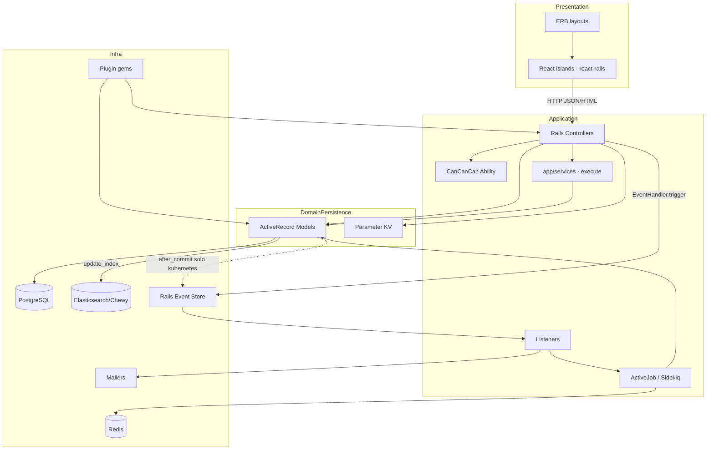
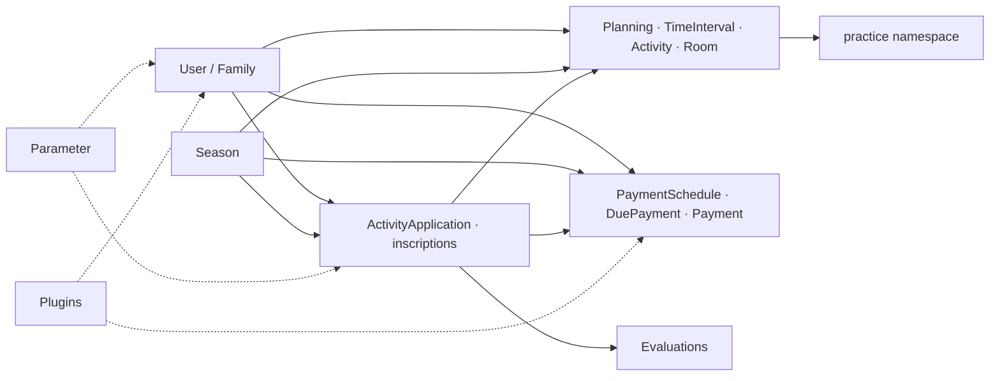
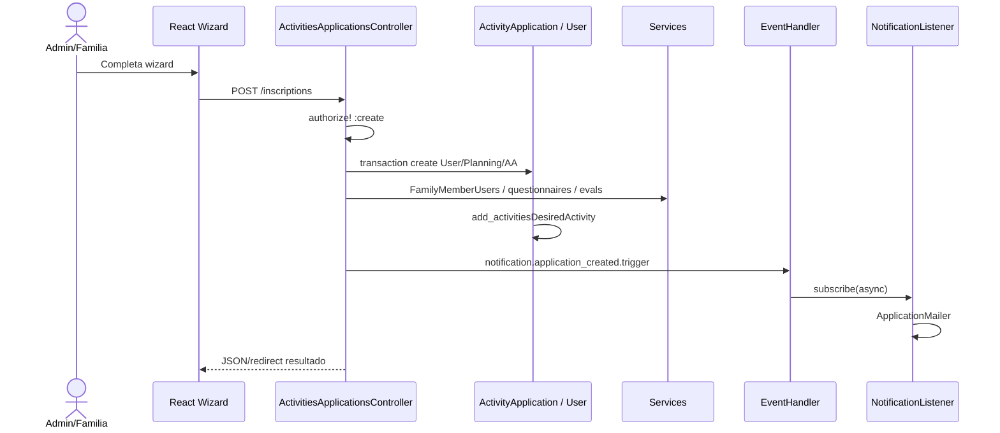
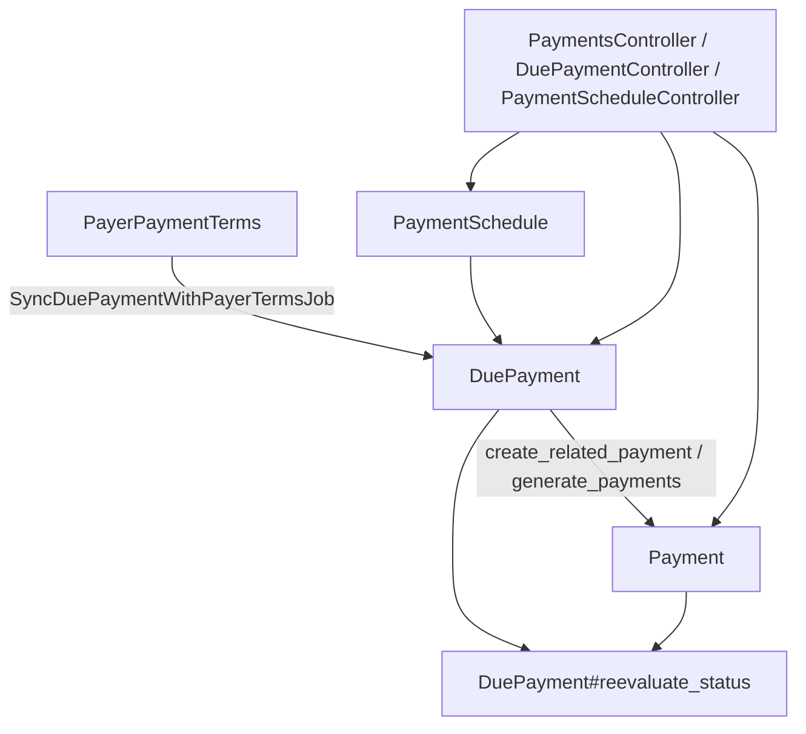
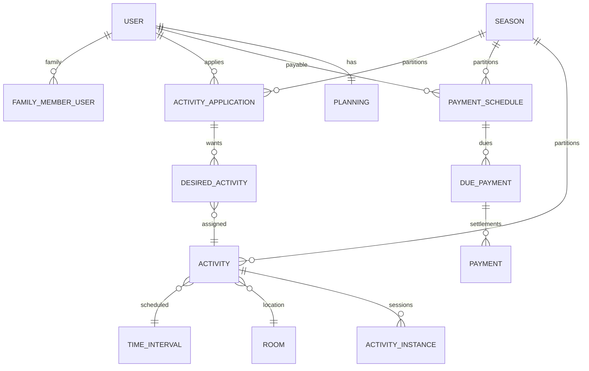

# 02 — Arquitectura del sistema (Fase 2)

> **Fuente:** `/Users/juanlizamah/Desktop/elvis`  
> **Complementa:** `01-repository-overview.md`  
> **Fecha:** 2026-07-13  

Leyenda: **[F]** hecho · **[I]** interpretación · **[R]** recomendación para *nuestro* producto futuro (no implementación aún).

---

## Resumen ejecutivo

Elvis es un **monólito Rails en capas** (MVC+) con:

- orquestación principalmente en **controllers gordos**;
- **service objects** emergentes (`app/services/**#execute`);
- **Active Record** como modelo de persistencia y hub de asociaciones;
- **arquitectura de plugins** real (`Elvis::PluginLoader`);
- bus de eventos **parcial** (`EventHandler` + Rails Event Store + listeners), con auto-eventos AR **gated** a `Rails.env.kubernetes?`.

No se observan hexagonal, clean architecture ni CQRS formales. El DDD aparece como **lenguaje ubicuo** (inscription, saison, échéance…), no como agregados/invariantes explícitos.

---

## 1. Capas observadas

```text
[ Presentación ]
  ERB + react_component (islas React)     frontend/packs, frontend/components
        ↓ HTTP
[ Aplicación / Orquestación ]
  Controllers (use-cases de facto)        app/controllers/**
  Ability (política)                      app/models/ability.rb
        ↓
[ Casos de uso extraídos ]
  Service objects                         app/services/**  (#execute / #call)
  Jobs                                    app/jobs/**
  Listeners                               app/listeners/**
        ↓
[ Dominio + persistencia mezclados ]
  ActiveRecord models                     app/models/**
  ApplicationRecord (destroy graph, events)
        ↓
[ Infraestructura ]
  PostgreSQL · Chewy/ES · Redis · Sidekiq(opt) · Sentry · Mailers
  lib/elvis (EventHandler, PluginLoader, Hook)
  OIDC Rack endpoints                     lib/*_endpoint.rb
```

### Evidencia de “dónde vive la lógica” **[F]**

| Ubicación | Tamaño / prueba | Rol |
|-----------|-----------------|-----|
| `ActivitiesApplicationsController` | **1965** líneas | Orquestación de matrícula/`inscriptions` |
| `PaymentsController` | **1379** líneas | Orquestación de cobros/pagos |
| `PlanningController` | **790** líneas | Planning UI/API |
| `User` | **1132** líneas | Hub de asociaciones + métodos |
| `ActivityApplication` | **189** líneas | Más delgado; `#add_activities`, `#pre_destroy` |
| `app/services/**` | Docenas de clases | Extractos: seasons, activities, due_payments, users… |

**[I]** Elvis evolucionó desde un MVC monolítico hacia services puntuales, **sin** reescribir controllers críticos.

**[R]** En un sistema propio: no replicar controllers de 2k líneas; modelar casos de uso explícitos desde el día 1 alrededor de hubs **Persona/Familia** y **Periodo/Temporada**.

---

## 2. Diagrama — arquitectura general



---

## 3. Diagrama — dependencias entre módulos (soft boundaries)



**[F]** No hay Packwerk/engines que enforcen estos límites: son namespaces de carpetas/rutas.

**[F]** Hubs dominantes: `User` (familia, pagos, inscriptions, planning) y `Season` (`season_id` en la mayoría de agregados temporales).

---

## 4. Puntos de entrada **[F]**

| Entrada | Evidencia |
|---------|-----------|
| HTTP / Devise | `ApplicationController#authenticate_user!`, path `/u` |
| React islands | `react_component(...)` en ERB + `frontend/packs/app.js` |
| Jobs | ActiveJob; Sidekiq si `USE_SIDEKIQ=true` (`config/initializers/sidekiq.rb`) |
| Cron | `config/schedule.rb` + `60-recurring-job-init.rb` |
| Boot plugins | `30-elvis.rb` → `PluginInitJob` → `Elvis::PluginLoader.db_load` |
| OIDC | `namespace :oidc` + `AuthorizationEndpoint` / `TokenEndpoint` |
| Health | `/ping`, `/health` |

---

## 5. Flujo de datos (runtime)

1. Browser carga layout Rails + pack `app`.
2. Componente React llama endpoints REST-ish del controller.
3. `authorize!` / Ability filtra.
4. Controller (a menudo dentro de `Model.transaction`) crea/actualiza AR.
5. Chewy indexa modelos marcados con `update_index`.
6. Eventos:
   - **manuales** desde controllers (`EventHandler.notification.*.trigger`);
   - **automáticos** AR create/update/destroy solo en `kubernetes` (`ApplicationRecord`).
7. Listeners → mailers / jobs de precios / cache bust.
8. Redis: colas (si Sidekiq), cache (k8s), performance tooling.

---

## 6. Flujo funcional — matrícula (`inscriptions`)



**Entrada:** `POST /inscriptions` · `ActivitiesApplicationsController#create`  
**Persistencia:** `ActivityApplication.transaction` (bloque largo en controller)  
**Servicios implicados (ejemplos):** `FamilyMemberUsers`, `NewStudentLevelQuestionnaires::CreateWithAnswers`, `EvaluationAppointments::AssignStudent`, `Adhesions::CreateAdhesion` (en update por status)  
**Update:** `#update` re-registra instancias (`Activities::RegisterStudentToActivityInstances`), puede `DuePayments::StopActivity`, dispara `activity_accepted` si status `PROPOSAL_ACCEPTED_ID`.

Estados builtin: `ActivityApplicationStatus` (`TREATMENT_PENDING_ID`, `PROPOSAL_ACCEPTED_ID`, …) — `app/models/activity_application_status.rb`.

---

## 7. Flujo funcional — cargos / pagos (esqueleto)



**[F]** Controllers de schedule/due son más delgados que inscriptions; mucha lógica en `DuePayment#reevaluate_status` / `#create_related_payment`.  
**[F]** Importaciones: `Payments::ImportFile`.  
**[I]** Billing (tarifas/prorratas) y Payments (liquidación) están **mezclados** en el mismo hub User/Season — no hay bounded context explícito.

---

## 8. Modelo de dominio principal (vista arquitectónica)



Detalle de atributos/reglas → Fase 3 (`03-domain-model.md`).

---

## 9. Estilos arquitectónicos — veredicto con evidencia

| Estilo | Veredicto | Evidencia |
|--------|-----------|-----------|
| Layered monolith | **Soportado** | `app/controllers|models|views|services|jobs` |
| Modular monolith | **Parcial** | `practice`, `parameters`, clusters por nombre; sin enforcer |
| Plugin architecture | **Soportado** | `lib/elvis/plugin_loader.rb:Elvis::PluginLoader`, `PluginInitJob`, docs Plugin-* |
| Event-driven | **Parcial** | `EventHandler`/`Event`/`BaseListener`; paths críticos aún síncronos; AR events solo kubernetes |
| DDD formal | **Parcial (lenguaje)** | Términos FR de escuela; sin aggregates/VOs/repos explícitos |
| Hexagonal / Clean | **No observado** | Infra llamada desde controllers/models/listeners |
| CQRS | **No observado** | Mismo modelo write/read; Chewy = search, no read-model de negocio |
| SOA | **No observado** | Un proceso Rails |

---

## 10. Patrones de diseño presentes

| Patrón | Estado | Evidencia |
|--------|--------|-----------|
| Active Record | Sí | Todo el dominio |
| Service Object | Sí | `app/services/**#execute` |
| Policy | Sí | `Ability`, `Abilities::ActivityApplicationAbilities` |
| Observer/Event bus | Sí (custom) | `lib/elvis/event_handler.rb`, `event.rb` |
| Plugin / loadable modules | Sí | `PluginLoader.db_load` |
| Repository | No | Queries en controllers |
| Form Object | No observado | — |
| Query Object | Parcial / ad-hoc | `#get_query_from_params` en controllers |

---

## 11. Eventos, jobs y hooks

### EventHandler **[F]**

- API: `EventHandler.<group>.<event>.subscribe` / `.trigger` (`lib/elvis/event_handler.rb`, `event_group.rb`, `event.rb`)
- Contrato de bloque: `{ sender:, args: }`
- Async: genera subclase dinámica de `BaseEventJob`
- Store: `Rails.configuration.event_store` (initializer `50-event_subscriber.rb`)

### ApplicationRecord **[F]**

```ruby
# app/models/application_record.rb
if Rails.env.kubernetes?
  after_commit :commit_callback
  before_save :register_changes
end
```

Emite `EventHandler.<model>.create|update|destroy`.

### Listeners principales **[F]**

`NotificationListener`, `UserListener`, `SeasonListener`, `FormuleListener`, `ActivityRefListener`, `ActivityRefPricingsListener`, `ParameterListner`, `PluginStateListener`, `BddListeners`, `ErrorCatcher`.

### Parallel: `Elvis::Hook` **[F]**

Estilo Redmine `call_hook` — coexistencia con EventHandler (linaje Ziggy/Redmine).

---

## 12. Transacciones **[F]**

Usadas en flujos críticos:

- `ActivitiesApplicationsController#create` / `#update` → `ActivityApplication.transaction`
- `Seasons::SeasonSwitcher` → `ActiveRecord::Base.transaction`
- `SyncDuePaymentWithPayerTermsJob` → `DuePayment.transaction`
- `DestroyJob`, `Activities::AddStudent`, `Payments::ImportFile`, etc.

**[I]** Muchos CRUDs de pago individual no envuelven multi-agregado en transacción explícita.

---

## 13. Validaciones y reglas **[F]**

- Validaciones AR **dispersas y escasas** en hubs de inscripción/pago; más densas en `Season`, formularios/formule, coupons.
- Reglas runtime vía **`Parameter.get_value("dotted.label")`** (status por defecto de AA, authorize teachers, flags de mail, cache…).

**[R]** Separar *policy configurável* de *invariantes de dominio* en diseño objetivo.

---

## 14. Errores **[F]**

| Mecanismo | Ubicación |
|-----------|-----------|
| `CanCan::AccessDenied` | `ApplicationController` rescue → 403 |
| `BaseRendererError` | `app/errors/` + ErrorCatcher → `ErrorRegisterJob` |
| `DestroyEndError` | `DestroyJob` + evento `destroy_ended` |
| Sentry | rescates en create de inscriptions |

También grafo de borrado en `ApplicationRecord` (`destroy_params`, `objects_that_reference_me`) — política de integridad referencial a nivel app.

---

## 15. Convenciones de nombres **[F]**

- Dominio UI/rutas en francés (`inscriptions`, échéances).
- Models inglés Rails (`ActivityApplication`).
- Parameters: `activityApplication.default_status` (camel + dot).
- Services: `Namespace::VerbNoun#execute`.
- Typos conservados: `ParameterListner`, `pratice_parameters_controller`.

---

## 16. Integraciones externas

| Integración | Evidencia |
|-------------|-----------|
| Elasticsearch | Chewy indexes `app/chewy/*` |
| Redis | Sidekiq, cache k8s, performance |
| S3 / Azure Blob | gems + `STORAGE_ACCOUNT` |
| Sentry | gems |
| Plugin marketplace | webhook CI a `elvis-plugins-marketplace.callingelvis.com` |
| reCAPTCHA | gem |
| PDF | wicked_pdf |

---

## 17. Implicaciones para nuestro diseño futuro **[R]** (no implementación)

1. **Adoptar la idea** de hubs `People/Family` + `Season/Period` + `Enrollment` + `Scheduling` + `Billing/Payments`.  
2. **No adoptar** fat controllers ni licensing GPL de código.  
3. **Adaptar** EventHandler → bus de dominio con contract tests y **mismo comportamiento en todos los envs**.  
4. **Adaptar** Parameter-store solo para configuración, no para reglas de integridad monetaria.  
5. **Investigar** plugins solo si necesitamos multi-tenant white-label; si no, módulos internos versionados bastan.  
6. Separar **Billing** (cargos/tarifas) de **Payments** (liquidación/conciliación) — Elvis los une vía User/Season.

Detalle de adopción → Fase 8 (`08-adoption-matrix.md`).

---

## 18. Incertidumbres **[?]**

1. Completitud OIDC sin modelos en este clone.  
2. Matriz exacta de entornos donde Sidekiq y AR-events están activos en prod real.  
3. Alcance de plugins de pagos (Stripe, etc.) no presentes aquí.  
4. Si `EventRules` / notificaciones condicionadas están incompletas a propósito.  
5. Política real de dual AMS vs `as_json`.

---

## 19. Archivos revisados (Fase 2)

- Controllers: `activities_applications_controller.rb`, `payments_controller.rb`, `planning_controller.rb`, payment schedule/due controllers (vía exploración)
- Models: `application_record.rb`, `activity_application.rb`, `activity_application_status.rb`, `user.rb`, `season.rb`, `payment*.rb`, `due_payment.rb`
- `app/services/**` (inventario completo de namespaces)
- `lib/elvis/event_handler.rb`, `event.rb`, `event_group.rb`, `plugin_loader.rb`
- `app/listeners/*`, `app/jobs/*` (muestra)
- `config/routes.rb`, initializers 30/50/60, `schedule.rb`
- Frontend packs y carpetas `activityApplications`, `planning`, `payments*`

Exploración: [Elvis architecture deep dive](0cf7efa3-1303-4c8e-a012-b2af8ec53397).

---

## 20. Qué sigue

- **Fase 3:** `03-domain-model.md` — glosario Elvis → equivalentes nuestros, atributos, estados, relaciones por entidad.
- Profundizar estados de `ActivityApplicationStatus`, árbol familiar, y ciclo DuePayment↔Payment.
