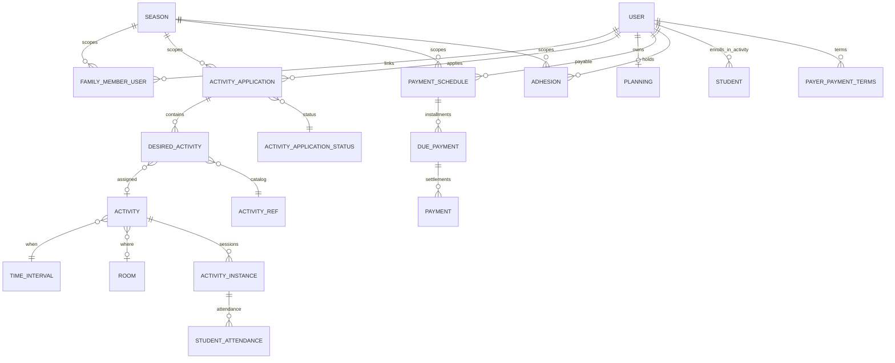

# 03 — Modelo de dominio (Fase 3)

> **Fuente:** `/Users/juanlizamah/Desktop/elvis/app/models/**` + `db/schema.rb`  
> **Complementa:** `01-repository-overview.md`, `02-architecture.md`  
> **Fecha:** 2026-07-13  

Leyenda: **[F]** hecho · **[I]** interpretación · **[R]** recomendación futura · **[?]** incertidumbre.

---

## Resumen

Elvis no modela un agregado `Family` explícito ni un tenant multi-escuela. El dominio gira sobre:

1. **`User`** como persona (alumno / profesor / admin / payeur / compte rattaché).  
2. **`FamilyMemberUser`** como enlace familiar por **temporada**, con flags de rol.  
3. **`Season`** como partición temporal casi global.  
4. **`ActivityApplication`** (`demande d'inscription` / ruta `/inscriptions`) como solicitud de matrícula.  
5. Árbol de cobro **`PaymentSchedule → DuePayment → Payment`**.  
6. Scheduling **`Planning → TimeInterval → Activity → ActivityInstance`**.

**[F]** Soft-delete vía `acts_as_paranoid` en varios modelos clave.  
**[F]** No hay gema de state machine (AASM): los estados son tablas + constantes ID.

---

## 1. Lenguaje ubicuo Elvis → equivalentes producto

| Término Elvis (FR / modelo) | Significado **[F]** | Equivalente propuesto **[R]** |
|-----------------------------|---------------------|--------------------------------|
| `utilisateur` / `User` | Persona del sistema | Person / Account holder |
| `membre de famille` / `FamilyMemberUser` | Relación A↔B en una saison | FamilyLink / GuardianRelation |
| élève (relacional) | Usuario con `Student` / inscriptions | Student |
| professeur / `is_teacher` | Rol booleano + asociaciones docente | Teacher |
| payeur / `is_paying` + `is_paying_for` | Quién paga | Payer / BillingContact |
| compte rattaché / `attached_to` | Cuenta hija sin password propio | DependentAccount |
| `saison` / `Season` | Periodo académico con ventanas de inscripción | AcademicPeriod / Season |
| `demande d'inscription` / `ActivityApplication` | Solicitud de matrícula (`/inscriptions`) | EnrollmentApplication |
| `activité souhaitée` / `DesiredActivity` | Curso/producto deseado en la solicitud | EnrollmentLineItem |
| pré-inscription / `PreApplication*` | Renovación / re-matricula | ReEnrollment |
| `formule` / `Formule` | Pack de ítems del catálogo | ProgramPackage |
| `activité` (catálogo) / `ActivityRef` | Producto pedagógico ofertable | CourseOffering / CatalogItem |
| `cours` / `Activity` | Grupo/clase concreta en calendario | ClassGroup / ScheduledCourse |
| `séance` / `ActivityInstance` | Sesión puntual | ClassSession |
| `créneau` / `TimeInterval` | Intervalo horario (kinds: c/p/e/…) | TimeSlot |
| `salle` / `Room`, `lieu` / `Location` | Espacio físico | Room / Site |
| `planning` / `Planning` | Agenda del usuario | PersonalSchedule |
| présence / `StudentAttendance` | Asistencia a séance | AttendanceRecord |
| `échéancier` / `PaymentSchedule` | Plan de pagos de un payable | PaymentPlan |
| `échéance` / `DuePayment` | Cuota prevista | Charge / InstallmentDue |
| `règlement` / `Payment` | Liquidación recibida | Payment / Receipt |
| `adhésion` / `Adhesion` | Cuota de socios | MembershipFee |
| `école` / `School` | Config del site (casi singleton) | SchoolProfile |
| `organisation` / `Organization` | Datos pro/empresa en User | OrganizationProfile |
| paramètres / `Parameter` | KV de configuración | Feature/Config Store |

---

## 2. Diagrama de dominio principal



---

## 3. Personas y familias

### 3.1 `User` — `app/models/user.rb`

| Aspecto | Detalle **[F]** |
|---------|-----------------|
| Responsabilidad | Identidad + roles + asociaciones a casi todo el dominio |
| Soft-delete | `acts_as_paranoid` |
| Auth | Devise (+ token); email uniqueness customizada (cuentas attached) |
| Chewy | `update_index("users")` |
| Roles | `admin?`, `creator?`, `teacher?`, `simple?` (flags booleanos) |
| Familia | `family` / `family_links` / `whole_family` (vía FMU) |
| Pagador | `is_paying`, `is_paying_for?`, `get_users_paying_for_self` |
| Cuentas hijas | `attached_to` / `attached_accounts` |
| Season | **No** tiene `season_id`; se filtra por asociaciones |
| Org | `belongs_to :Organization` opcional |

**Reglas / métodos clave [F]:**

- `unique_entry`, `valid_birth_date` — validaciones propias.  
- `planning` se crea `before_create`.  
- `destroy_params` / `pre_destroy` — cascada controlada + detach de attached accounts.  
- **No existe `student?`** — el rol “élève” es relacional (`Student`, applications).

**[I]** `User` es un mega-agregado de facto → alto acoplamiento.  
**[R]** Separar Person, Account, Role bindings y Family como bounded contexts.

### 3.2 `FamilyMemberUser` — `app/models/family_member_user.rb`

| Aspecto | Detalle **[F]** |
|---------|-----------------|
| Significado | Arista user↔member con `link` (père/mère/enfant…) |
| Flags | `is_paying_for`, `is_legal_referent`, `is_to_call`, `is_accompanying` |
| Season | `season_id` opcional en schema; scope `for_season_id` hereda enlaces de temporadas ≤ pedida |
| Soft-delete | sí |
| Eventos cache | `invalidate_family_cache` after save/destroy |

**[F]** No hay entidad `Family`; la familia es un **grafo de enlaces**.  
**[R]** Modelar `Family` (o Household) como agregado con members + roles tipados reduce ambigüedad del dual payeur.

### 3.3 `Student` — `app/models/student.rb`

Join User↔Activity (inscripción operativa al cours), distinto de `ActivityApplication` (solicitud administrativa).

**[I]** Convivencia solicitud vs plazas reales: application → desired → activity assignment → `Student` rows.

---

## 4. Temporadas — `Season` (`app/models/season.rb`)

| Aspecto | Detalle **[F]** |
|---------|-----------------|
| Responsabilidad | Periodo académico + ventanas de inscripción |
| Campos clave | `start`, `end`, opening/closing application dates, `is_current`, `is_off`, `next_season` |
| Validaciones | presencia fechas; `check_start_end`, `check_applications_dates` |
| Métodos | `current`, `next`, `current_apps_season`, `registration_opened`, `is_pre_application_period`, `all_seasons_cached` |
| Relaciones | holidays, teachers (`TeacherSeason`), pricings, FMUs |

**Estados [I]:** current / off / chain next — no enum formal.  
**Regla [F]:** `pre_destroy` impide borrar la saison courant.

**[R]** Tratar Season/AcademicPeriod como contexto propio con calendario de ventanas (open enrollment / re-enrollment / closed).

---

## 5. Matrícula / inscripción

### 5.1 `ActivityApplication` — `app/models/activity_application.rb`

| Aspecto | Detalle **[F]** |
|---------|-----------------|
| Nombre UI | demande d'inscription · ruta `/inscriptions` |
| Asoc. | `user`, `season`, `activity_application_status`, `referent`, `formule?`, `desired_activities`, evaluation appointments, pre_application* |
| Soft-delete | sí · Chewy `activity_applications` |
| Campos ciclo | `begin_at`, `stopped_at`, `reason_of_refusal`, `status_updated_at`, `mail_sent_at` |
| Métodos | `add_activity` / `add_activities`, `availabilities`, `pre_destroy`, `refresh_status_updated_at` |

**Validaciones AR:** escasas; estado inicial vía `Parameter` `activityApplication.default_status` **[F]** (controller/model).

### 5.2 `ActivityApplicationStatus` — `app/models/activity_application_status.rb`

Constantes builtin (IDs **fijos** — comentario “conserver ces identifiants”):

| Const | ID | Label |
|-------|-----|-------|
| `TREATMENT_PENDING` | 1 | En attente de traitement |
| `TREATMENT_IN_PROGRESS` | 2 | En cours de traitement |
| `ACTIVITY_ATTRIBUTED` | 5 | Cours attribué |
| `ACTIVITY_PENDING` | 7 | Cours en attente |
| `STOPPED` | 9 | Arrêtée (`is_stopping`) |
| `ASSESSMENT_PENDING` | 10 | Attente résultat évaluation |
| `CANCELED` | 12 | Annulée |
| `TREATMENT_IMPOSSIBLE` | 13 | Demande non satisfaite |
| `PROPOSAL_ACCEPTED` | 17 | Proposition acceptée |
| `PROPOSAL_REFUSED` | 18 | Proposition refusée |
| `ACTIVITY_PROPOSED` | 19 | Cours proposé |
| `WAITING_LIST` | 20 | Sur liste d'attente |

**Transiciones [F]:** actualización manual del FK `activity_application_status_id` (admin/UI/controller); sin máquina formal.  
**[R]** Explicit state machine + permisos por transición + eventos de dominio por cambio de estado.

### 5.3 `DesiredActivity` — `app/models/desired_activity.rb`

Línea de pedido de la inscription: `activity_ref` + opcional `activity` asignada + `pricing_category` + options/discount.  
Precios legacy por “frequency codes” coexisten con pricing por saison **[F/?]**.

### 5.4 `PreApplication*` 

Contenedor de **réinscription** por user+season (`PreApplication`, `PreApplicationActivity`, `PreApplicationDesiredActivity`) con `action`/`status`/`reset`.

---

## 6. Catálogo — `ActivityRef` / `Formule`

| Concepto | Archivo | Responsabilidad **[F]** |
|----------|---------|-------------------------|
| `ActivityRef` | `activity_ref.rb` | Ítem de catálogo (edades, cupos, tipo, pricings por saison) |
| `Formule` | `formule.rb` | Bundle de ActivityRef/Kind; `display_price(season)` |
| `ActivityRefPricing` / `PricingCategory` | models | Tarifas tipadas por temporada |

**[R]** Separar Catalog (qué se ofrece) de Enrollment (qué pide la familia) de Scheduling (qué grupo concreto existe).

---

## 7. Planificación y horarios

### Entidades **[F]**

| Modelo | Responsabilidad |
|--------|-----------------|
| `Planning` | Agenda del `User` + time_slots |
| `TimeInterval` | Créneau (`kind`: `c` cours, `p` disponibilités, `e` evaluación, `o` option, `practice`…) |
| `Activity` | Cours concreto: interval + room + teachers + students |
| `ActivityInstance` | Séance (ocurrencia); cover teacher; attendances |
| `Room` / `Location` | Espacio / sitio |
| `StudentAttendance` | Presencia (`attended`, `is_option`) |

**Conflictos [F]:** métodos tipo `overlap_room`, `overlap_teacher`, `check_for_conflict` en TimeInterval/Activity/ActivityInstance.  
**Season [F]:** a menudo derivada del intervalo de fechas (`Season.from_interval`), no siempre FK directa.

**[R]** Bounded context Scheduling con invariantes de no-solape teacher/room y generación de instancias como comando explícito.

---

## 8. Cobros y pagos

### Árbol **[F]**

```text
User (payable)
  └─ PaymentSchedule (season, location, status)
       └─ DuePayment (number, previsional_date, amount, operation +/−/0, method, status)
            └─ Payment (amount, cashing_date, method, status)
PayerPaymentTerms (payer + season + PaymentScheduleOptions [+ method])
  └─ SyncDuePaymentWithPayerTermsJob → genera DuePayments
```

### `DuePayment#reevaluate_status` — `app/models/due_payment.rb` **[F]**

1. Si `total_payed >= adjusted_amount` → **PAID**  
2. Else si aún no llegó `previsional_date` → no cambia  
3. Else si hay `Payment` FAILED → **FAILED**  
4. Else → **UNPAID**

`create_related_payment` crea `Payment` y reevalúa.

### Métodos de pago / estados **[F]**

- `PaymentMethod` builtins (Espèces, Chèque, Prélèvement, CB, Virement…).  
- `DuePaymentStatus` y `PaymentStatus` — tablas paralelas **no idénticas** **[I]** riesgo de inconsistencias semánticas.

### `Adhesion` / `AdhesionPrice` **[F]**

Cuota de membership aparte del árbol de cours; fee también configurable por `Parameter`.  
**[?]** `Adhesion has_one :payment_method` parece incompleto.

**[R]** Separar:

- **Billing:** tarifas, cargos (`Charge`), planes, prorratas, membership.  
- **Payments:** liquidaciones, conciliación, fallos, reembolsos.  
Elvis mezcla ambos alrededor de User/Season.

---

## 9. Seguimiento pedagógico (brief)

| Modelo | Rol **[F]** |
|--------|-------------|
| `EvaluationAppointment` | RDV evaluación (student/teacher, créneau, room, activity_ref, AA opcional) |
| `StudentEvaluation` | Evaluación con answers |
| `EvaluationLevelRef` / `Level` | Niveles por user×activity_ref×season |

**[R]** Follow-up / AcademicProgress context, acoplado a Enrollment sin mezclar cash.

---

## 10. Configuración y org

| Modelo | Rol **[F]** |
|--------|-------------|
| `Parameter` | Store tipado `label`/`value`; `get_value` cacheado |
| `School` | Perfil del site (nombre, SIRET, logo…) ~singleton |
| `Organization` | Datos empresa en User — **no** multi-tenant |
| `Plugin` | Registro de extensiones (infra) |

**Partición real [F/I]:** `season_id` (+ a veces `location_id`), no `school_id` como tenant.

---

## 11. Agregados informales (lectura DDD) **[I]**

Elvis no declara aggregates; lectura razonable para rediseño:

| Agregado candidato | Raíz probable | Invariantes tentativos |
|--------------------|---------------|------------------------|
| Household | Family (nuevo) / cluster FMU | Un legal referent; ≥1 payer activo por season |
| EnrollmentApplication | `ActivityApplication` | Status consistente; desired items pertenecen a la AA |
| ClassGroup | `Activity` | Cupos; teacher/room conflicts |
| PaymentPlan | `PaymentSchedule` | Σ dues coherente; paid ≤ due |
| SeasonCalendar | `Season` | Fechas válidas; una current |

**[R]** Formalizar estos límites en el producto objetivo (Fase 7).

---

## 12. Relación con asistencia

`StudentAttendance` une `User` + `ActivityInstance`.  
La actividad “activa” de un alumno considera `begin_at`/`stopped_at` de la application **[F]** (lógica en `ActivityInstance#active_students` etc.).

---

## 13. Gotchas del dominio **[F/?]**

1. Dual payeur: flag User + flag FMU.  
2. Herencia de enlaces familiares entre seasons (`for_season_id`).  
3. `PaymentSchedule` columnas polimórficas pero asociación User-first.  
4. Pricing legacy vs pricing por saison coexisten.  
5. IDs de status inscription **hardcoded** — migrar IDs es peligroso.  
6. `User#confirmed?` stub vacío **[F según exploración]** — riesgo auth.  
7. Organization ≠ school multi-tenant.  
8. Chewy no indexa el árbol de pagos.

---

## 14. Implicaciones para nuestro producto **[R]**

| Contexto objetivo | Qué adoptar de Elvis | Qué no copiar |
|-------------------|----------------------|---------------|
| People & Families | Grafo roles (payer/legal/contact) + cuentas dependientes | Mega-`User` |
| Academic Period | Season + ventanas open/re-enroll | IDs mágicos sin doc |
| Enrollment | Application + line items + status workflow | Status sin máquina + lógica en controller 2k LOC |
| Scheduling | Course vs session vs slot; conflict checks | Mezclar disponibilités y cours sin tipos claros |
| Billing / Payments | Plan → due → payment + reevaluación | Semánticas due/payment status duplicadas sin mapa |
| Attendance | Session-level records | — |
| Follow-up | Eval appointments/levels | — |

---

## 15. Archivos revisados (Fase 3)

- `user.rb`, `family_member_user.rb`, `season.rb`
- `activity_application.rb`, `activity_application_status.rb`, `desired_activity.rb`, `pre_application*.rb`
- `planning.rb`, `time_interval.rb`, `activity.rb`, `activity_instance.rb`, `room.rb`, `location.rb`, `student.rb`, `student_attendance.rb`
- `payment_schedule.rb`, `due_payment.rb`, `payment.rb`, `payer_payment_terms.rb`, `adhesion.rb`
- `activity_ref.rb`, `formule.rb`, `parameter.rb`, `organization.rb`, `school.rb`, `plugin.rb`
- Evaluación (muestra): appointment/evaluation/level
- Exploración sintetizada: [domain deep dive](87d3479c-e267-47ba-8203-b7071a02a7cc)

---

## 16. Qué falta / siguiente

- **Fase 4:** flujos end-to-end con puntos de entrada, permisos y errores (`04-business-flows.md`).  
- Trazar en detalle: crear familia+alumno, abrir saison, generar échéancier desde `PayerPaymentTerms`, presencia.  
- Confirmar en código `User#confirmed?` y Adhesion↔PaymentMethod.
