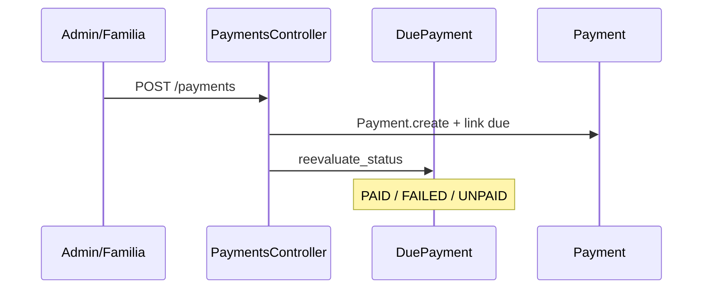

# 04 — Flujos de negocio (Fase 4)

> **Fuente:** `/Users/juanlizamah/Desktop/elvis`  
> **Complementa:** `02-architecture.md`, `03-domain-model.md`  
> **Fecha:** 2026-07-13  

Leyenda: **[F]** implementado con evidencia · **[P]** parcial / hueco · **[N]** no observado · **[R]** cómo añadirlo respetando el patrón Elvis.

**Caveat transversal [F]:** auto-eventos AR (`ApplicationRecord#commit_callback`) solo si `Rails.env.kubernetes?`. Los `.trigger` explícitos sí corren en cualquier env.

Patrón objetivo Elvis (y sugerido para extensiones):

```text
Controller#action → authorize! → Service#execute (transaction)
  → EventHandler.<group>.<event>.trigger → Listener → Mailer/Job
```

---

## Índice de flujos

| # | Flujo pedido | Estado |
|---|--------------|--------|
| 1 | Creación / enlace de familia | **[F]** |
| 2 | Registro alumnos y responsables | **[F]** |
| 3 | Apertura de temporada | **[F]** con **[P]** (`SwitchSeasonJob` no cableado) |
| 4 | Matrícula / inscription | **[F]** |
| 5 | Asignación a grupos/actividades | **[F]** |
| 6 | Planificación de clases | **[F]** |
| 7 | Generación de horarios / instancias | **[F]** |
| 8 | Generación de cargos (échéances) | **[F]** con **[P]** en wizard |
| 9 | Registro y conciliación de pagos | **[F]** |
| 10 | Control de deuda | **[F]** |
| 11 | Asistencia | **[F]** |
| 12 | Seguimiento académico/admin | **[F]** |
| 13 | Notificaciones | **[F]** con **[P]** (`activity_assigned`) |
| 14 | Reportes / CSV | **[F]** |

---

## 1. Familia — creación / enlace

| Dimensión | Evidencia **[F]** |
|-----------|-------------------|
| Entrada | `PUT /users/:id/update_family` → `UsersController#update_family`; también embebido en `ActivitiesApplicationsController#create`; `DELETE /members/:id` → `FamilyMemberUsersController#destroy` |
| Actor | Familia (self + family_ids) · Admin |
| Servicio | `FamilyMemberUsers.addFamilyMemberWithConfirmation` · `inverse_link` — `app/services/family_member_users.rb` |
| Entidades | `User`, `Telephone`, addresses, `FamilyMemberUser` (`is_paying_for`, `is_legal_referent`, `is_to_call`, `is_accompanying`, `link`, `season_id`) |
| Persistencia | `save!` por miembro / link; **sin** transacción única envolvente en el service |
| Eventos | Cache `FamilyMemberUser#invalidate_family_cache`; no EventHandler de “family_linked” |
| Permisos | `authorize! :manage/:edit, user`; Ability `can :manage, User, id: family_ids` |
| Errores | Fallo de mail de confirmación logueado; retorno booleano del service **frágil [I]** |
| Resultado | Enlaces familiares bidireccionales por saison |

**[R]** Si se necesitara notificación: `EventHandler.notification.family_linked.trigger` + listener.

---

## 2. Registro de alumnos y responsables

| Camino | Evidencia **[F]** |
|--------|-------------------|
| Signup público | `RegistrationsController#create` (Devise path `/u`) — recaptcha, teléfonos, consent |
| Admin | `UsersController#create` |
| Alumno JSON | `UsersController#createStudent` |
| Durante inscription | Wizard `#create` + flags legal/payer |
| Import | `POST /import_users` → `Users::CsvImportHandler` |

| Dimensión | Detalle |
|-----------|---------|
| Actor | Guest / Admin / Familia |
| Entidades | `User`, `Planning`, `Telephone`, addresses, `ConsentDocumentUser`, `FamilyMemberUser` |
| Eventos | `EventHandler.notification.user_created` (vía `UserListener` si confirm) → Devise mailer |
| Resultado | Personas + roles de familia listos para temporada |

---

## 3. Apertura / activación de temporada

### 3.1 Create / update / make_active **[F]**

| Dimensión | Evidencia |
|-----------|-----------|
| Entrada | `SeasonsController#create` / `#update` / `#destroy`; `POST /season/:id/make_active` → `#make_active` |
| Actor | Admin (`authorize!` admin) |
| Servicios | `Seasons::SeasonSwitcher`, `Seasons::PopulateHolidays`, `Holidays::*` |
| Entidades | `Season`, `Holiday`; destroy limpia FMU de esa season |
| Persistencia | Switcher en transaction: marca `is_current`; invalida caches `current_season` |
| Eventos | `SeasonListener` en `season.create` / `season.update` (cadena `next_season`, +1 año). Auto-fire **solo kubernetes** |
| Errores | No destruir saison courant; `make_active` → 422 si falla |
| Resultado | Ventanas de inscripción + saison active |

### 3.2 `SwitchSeasonJob` **[P]**

| Dimensión | Evidencia |
|-----------|-----------|
| Qué hace | SQL copia `family_member_users` season anterior → nueva (`app/jobs/switch_season_job.rb`) |
| Cableado | Comentario en `SeasonsController#create`: `#SwitchSeasonJob.perform_now` — **no llamado desde `make_active`** |
| Estado | Implementado pero **desconectado del flujo operativo** |

**[R]** Tras `SeasonSwitcher.execute` exitoso:

```text
EventHandler.season.switched.trigger → SeasonListener → SwitchSeasonJob.perform_later
```

---

## 4. Matrícula — `POST /inscriptions`

**Controller:** `ActivitiesApplicationsController#create` (**~1965 LOC archivo**)

### Pasos principales **[F]**

1. `authorize! :create, ActivityApplication…`  
2. `ActivityApplication.transaction`  
3. Resolver/crear `@user` (myself / nuevo / attached)  
4. Levels desde `personalLevels`  
5. Perfil: birthday, handicap, GDPR, instrumentos, phones, addresses, `is_paying`  
6. `@user.planning.update_intervals(..., season.id)` — disponibilidades  
7. `save!` + consent docs  
8. Familia → `FamilyMemberUsers.addFamilyMemberWithConfirmation` + flags payer  
9. Opcional `payer_payment_terms` create/update  
10. Status inicial: `Parameter` `activityApplication.default_status` (else treatment pending)  
11. Por cada `selectedActivities`:  
    - `ActivityApplication.create!`  
    - `add_activities` → `DesiredActivity`  
    - PreApplication*, comments, preferences, questionnaires  
12. Evaluación opcional → `EvaluationAppointments::AssignStudent`  
13. Pack opcional  
14. Fuera txn: `EventHandler.notification.application_created.trigger` → `ApplicationMailer`

| Actor | Familia / Admin |
| Entidades | User, Planning, FMU, PayerPaymentTerms, AA, DesiredActivity, PreApplication*, Comment, Level, Pack, EvaluationAppointment |
| Errores | `IntervalTakenError` → 400; genérico → 500 + mail admin opcional |
| Resultado | Demande(s) d'inscription + mail |

**Update [F]:** `#update` re-registra instancias, puede `DuePayments::StopActivity`, y si status = `PROPOSAL_ACCEPTED` → `activity_accepted.trigger`.

---

## 5. Asignación a cours / grupos

| Entrada | Evidencia **[F]** |
|---------|-------------------|
| `POST /activity/:id/desired/:desired_activity_id` | `ActivityController#add_student` |
| Options / instruments | Controllers relacionados |
| Remove | `#remove_student` |

### Cadena **[F]**

```text
ActivityController#add_student
  → Activities::AddStudent#execute
  → Activities::RegisterStudentToActivityInstances#execute
  → Student / DesiredActivity.is_validated / Adhesion?
  → StudentAttendance por instancias futuras
  → status « Cours attribué » (si automático)
```

| Actor | Admin / teacher (Ability + Parameter teachers) |
| Errores | Curso lleno (`"Le cours est maintenant plein"`) |
| Eventos | Mail imperativo / jobs; **no** `.trigger` de `activity_assigned` en assign **[P]** |

---

## 6. Planificación de clases

| Entrada | `POST /activity` → `ActivityController#create` **[F]** |
|---------|--------------------------------------------------------|
| Pasos | Transaction: `TimeInterval` kind `c` → `Activity.create!` → `add_teacher` → `create_instances` → `Activities::AssignGroupsNames` |
| Actor | Admin (create Activity); teachers su planning |
| Conflictos | Helpers overlap room/teacher |
| Resultado | Cours recurrente validado + instancias |

UI: `PlanningController`, calendarios room/teacher, parámetros `parameters/planning_parameters`.

---

## 7. Generación de horarios / disponibilidades

### A. Instancias de cours sobre temporada **[F]**

`Activity#create_instances` + `TimeInterval#generate_for_rest_of_season` / `generate_over_season` (salta holidays).

### B. Disponibilidades alumno/profesor (`kind: "p"`) **[F]**

| Entrada | `PATCH /plannings/availabilities/:id` → `PlanningController#update_availabilities` |
| Servicio | `TimeIntervals::AvailabilitiesUtils` (kind hardcoded `'p'`) |
| Copy | `TimeIntervals::CopyAvailabilities` (kinds `p/c/o`) |
| Errores | `IntervalError` → 400 |
| Resultado | Créneaux de preferencia en planning del user |

---

## 8. Generación de cargos (échéances)

| Entrada | Evidencia |
|---------|-----------|
| Términos de pago | `UserPaymentsController#update_user_payment_terms_for_season` → **`SyncDuePaymentWithPayerTermsJob.perform_now`** **[F]** |
| Wizard inscription | Crea `payer_payment_terms` **sin** llamar Sync si no hay flujo posterior **[P]** |
| Manual | `PaymentScheduleController#create`, `DuePaymentController#create` |

### `SyncDuePaymentWithPayerTermsJob` **[F]**

1. Carga terms + schedule del payer/season (noop sin schedule)  
2. Creation: `PaymentHelper.generate_payer_payment_summary_data` → reparte total en meses → `due_payments.create!` (`created_by_payer_payment_term: true`) + adhesion due si aplica  
3. Update: ajusta method/día en dues futuras  

**[R]** Tras wizard (cuando exista schedule): encolar Sync o listener `payer_payment_terms.create`.

---

## 9. Registro y conciliación de pagos



| Paso | Evidencia **[F]** |
|------|-------------------|
| Create règlement | `PaymentsController#create` → `due_payment.reevaluate_status` |
| Generate from dues | `DuePaymentController#generate_payments` → `#create_related_payment` |
| Reconciliación | `DuePayment#reevaluate_status` (ver `03-domain-model.md`) |
| Import CSV | `PaymentsController` / `Payments::ImportFile` + `FailedPaymentImport` |
| Remind upcoming | `send_upcoming_payment_mail` → `EventHandler.notification.upcoming_payment` |

| Actor | Admin; familia `can :create, Payment` self |
| Resultado | Payments reconciliados contra échéances |

---

## 10. Control de deuda

| Mecanismo | Evidencia **[F]** |
|-----------|-------------------|
| Statuses | `DuePaymentStatus` UNPAID/FAILED · `PaymentStatus` paralelos |
| Listados | `POST /due_payments/list`, `POST /payments/list` + filtros status |
| Export | `/export` CSV |
| Reminders | `DuePaymentController#send_payment_mail` → `PaymentReminderMailer` |
| Batch | `DuePayment.mark_unpaid` / past unpaid |
| UI | `DuePaymentList.jsx`, `PaymentList.jsx` |

| Actor | Admin |
| Resultado | Operación de cartera / impagados |

**[N]** No se observó motor de “scoring de deuda” ni bloqueo automático de asistencia por impago — habría que añadirlo como policy + listener si se desea.

---

## 11. Asistencia

| Entrada | Evidencia **[F]** |
|---------|-------------------|
| Hoja | `GET /users/:id/presence_sheet/:date` → `UsersController#presence_sheet` |
| Update | `StudentAttendancesController#update` / `#update_all` / remarks |
| Absences | `AbsencesController` list/data/export (`attended != 1`) |

| Actor | Teacher (propia), Admin (global) |
| Entidades | `StudentAttendance` (creadas al assign / generate instances) |
| Eventos | Cancel → `activity_cancelled` (p.ej. `MyActivitiesController`) |
| Resultado | Presencias por séance + reporting |

---

## 12. Seguimiento académico / admin

| Concern | Evidencia **[F]** |
|---------|-------------------|
| Evaluaciones | `StudentEvaluationsController` → `StudentEvaluations::CreateOrUpdateEvaluationWithAnswers` |
| RDV evaluación | `EvaluationAppointments::*` |
| Comments | `CommentsController` + `ActivitiesApplicationsController#add_comment` |
| Levels | User levels / evaluation level refs |

| Actor | Teachers / Admin |
| Resultado | Evaluaciones + hilos comentarios en inscriptions |

**[N]** CRM/comercial de “tareas de seguimiento” genéricas no aparece como entidad dedicada; comments + statuses de inscription cubren parte del follow-up admin.

---

## 13. Notificaciones

`NotificationListener` (`app/listeners/notification_listener.rb`) **[F]:**

| Evento | Mailer | Trigger observado |
|--------|--------|-------------------|
| `user_created` | Devise confirmation | UserListener / params confirm |
| `application_created` | `ApplicationMailer` | AA `#create` / related |
| `activity_accepted` | `ActivityAcceptedMailer` | AA `#update` (PROPOSAL_ACCEPTED) |
| `activity_cancelled` | cancelled mailers | `MyActivitiesController` |
| `upcoming_payment` | `UpcomingPaymentMailer` | PaymentsController |
| `activity_assigned` | `ActivityAssignedMailer` | **Subscriber sí; `.trigger` no hallado [P]** — mails por vía directa |

Templates: `NotificationTemplate` + admin UI.

**[R]** Tras `Activities::AddStudent` exitoso → `EventHandler.notification.activity_assigned.trigger`.

---

## 14. Reportes / CSV

| Tipo | Evidencia **[F]** |
|------|-------------------|
| Inscriptions | `#list` format.csv; import TES `CsvImporterJob` + `ActivityApplications::TesImportHandler` |
| Users | index/list + import |
| Payments / dues | export_selected |
| Activities / refs | csv controllers |
| Absences | export |
| Infra | `lib/elvis/csv_exporter.rb`, parameters csv encoding |

| Actor | Admin |
| Resultado | Streams CSV (`;`) según Parameter |

---

## Mapa de cobertura vs necesidades producto

| Necesidad | En Elvis | Notas |
|-----------|----------|-------|
| Familia + responsables | Sí | FMU + wizard |
| Abrir periodo | Sí | SeasonSwitcher; copy FMU **[P]** |
| Matricular | Sí | `/inscriptions` monolítico |
| Asignar grupo | Sí | AddStudent chain |
| Horarios | Sí | instances + availabilities `p` |
| Cargos | Sí | Sync job; gap wizard |
| Pagos / deuda | Sí | reevaluate + listas |
| Asistencia | Sí | presence_sheet |
| Follow-up | Parcial | eval + comments; no task CRM |
| Notifs | Sí | bus incompleto en assign |
| Reportes | Sí | CSV |

---

## Huecos explícitos (para fase 7–8)

1. **`SwitchSeasonJob` desconectado** del make_active.  
2. **Wizard Terms → Dues** sin Sync automático.  
3. **`activity_assigned`** listener sin trigger.  
4. **AR events** env-gated → comportamiento distinto local vs k8s.  
5. **Deuda → bloqueo de servicio** no observado.  
6. **Factura formal / tax invoice** no auditada como entidad (pago ≠ factura fiscal).  
7. **Devoluciones / refunds** vía statuses (Remboursée) — flujo UI a confirmar en Fase posterior.  
8. **CRM tasks** no observado.

---

## Archivos revisados (Fase 4)

- `ActivitiesApplicationsController`, `ActivityController`, `UsersController`, `SeasonsController`
- `PaymentsController`, `DuePaymentController`, `PaymentScheduleController`, `UserPaymentsController`
- `PlanningController`, `StudentAttendancesController`, `AbsencesController`, `MyActivitiesController`
- Services: `FamilyMemberUsers`, `Activities::AddStudent`, `RegisterStudentToActivityInstances`, seasons/*, payments/*, time_intervals/*
- Jobs: `SwitchSeasonJob`, `SyncDuePaymentWithPayerTermsJob`, `NotifyUsersOfApplicationStateJob`, `CsvImporterJob`
- `NotificationListener`, `SeasonListener`, `UserListener`
- Routes: `inscriptions`, `presence_sheet`, payments/dues
- Exploración: [business flows](970a7c37-67bf-4ed4-ac87-8ba54e874acf)

---

## Siguiente

**Fase 5** — extensibilidad (`05-extension-mechanisms.md`): plugins, EventHandler, hooks, Parameter, feature-like configs.
