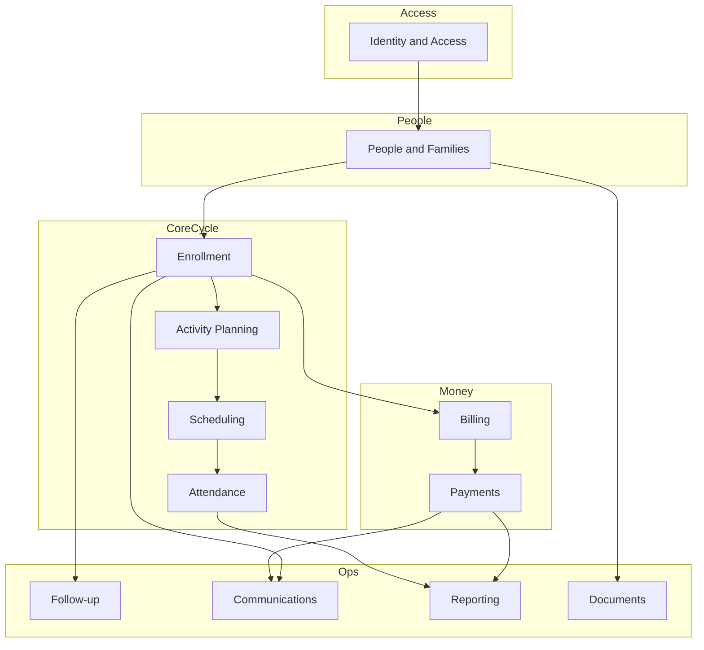

# 07 — Propuesta de dominio objetivo (Fase 7)

> **Base:** análisis Elvis (`01`–`06`) · **No implementación** · **No copia GPL**  
> **Fecha:** 2026-07-13  
> **Producto referenciado:** plataforma de gestión académica (familias, matrícula, planning, cobros, seguimiento) — independiente del Track A MVP de Gmusic, salvo que Juan decida unificar.

Leyenda: **[E]** aprendido de Elvis · **[P]** propuesto para nosotros · **[D]** decisión pendiente

---

## Principios de diseño **[P]**

1. **Ideas sí, código Elvis no** (GPL-3 — ver `06`).  
2. **Bounded contexts** con contratos explícitos (eventos/comandos), no mega-`User`.  
3. **Periodo académico** como partición temporal (análogo a `Season`).  
4. Separar **Billing** (cargos/tarifas) de **Payments** (liquidación).  
5. Use-cases en capa de aplicación; controllers/UI delgados.  
6. Misma semántica de eventos en **todos** los entornos (evitar gate tipo `kubernetes?`).  
7. AuthZ por **recurso + rol**, nunca por boolean.  
8. Dinero en **cents + currency**; operaciones idempotentes.  
9. Extensión: módulos versionados internos primero; “plugins” solo si hay producto marketplace.  
10. Soft-delete / auditoría / PII con políticas explícitas.

---

## Mapa de contextos delimitados

---

## Contextos — definición

### 1. Identity and Access **[P]**

| | |
|--|--|
| Responsabilidad | Autenticación, sesiones, roles, permisos, cuentas dependientes |
| Entidades | `Account`, `Credential`, `RoleBinding`, `Session` |
| Value objects | `Email`, `AuthToken`, `Permission` |
| Agregado | `Account` |
| Servicios | Register, Login, ResetPassword, Impersonate (admin) |
| Comandos | `RegisterAccount`, `AssignRole`, `DisableAccount` |
| Consultas | `GetAccount`, `ListPermissions` |
| Eventos | `AccountRegistered`, `RoleAssigned` |
| Invariantes | Un email login activo por account raíz; dependent accounts sin password propio (idea Elvis attached) |
| Deps | — |
| Integraciones | Email provider; futuro IdP (no OIDC issuer Elvis) |

### 2. People and Families **[E→P]**

| | |
|--|--|
| Responsabilidad | Personas, hogares, roles familiares (payer/legal/contact) |
| Entidades | `Person`, `Household`, `HouseholdMembership`, `OrganizationProfile` (opcional B2B) |
| VO | `Phone`, `Address`, `RelationshipType`, `MembershipRole{Payer,LegalGuardian,EmergencyContact,Accompanying}` |
| Agregado | `Household` (preferred) o cluster versionado por periodo |
| Servicios | `LinkMembers`, `AssignPayer`, `MergePersons` |
| Comandos | `CreatePerson`, `CreateHousehold`, `AddMember`, `SetPayerForPeriod` |
| Consultas | `GetHousehold`, `ListPayersForStudent` |
| Eventos | `HouseholdUpdated`, `PayerChanged` |
| Invariantes | ≥1 legal guardian por menor; ≥1 payer activo por periodo de matrícula |
| Deps | IAM (Account↔Person) |
| Vs Elvis **[E]** | No hay `Family` entity; usar Household elimina ambigüedad FMU |

### 3. Academic Period (incluido aquí o propio) **[E→P]**

Puede vivir como subcontexto de Planning o contexto corto **`AcademicPeriod`**:

- Entidad `AcademicPeriod` (start/end, enrollment windows, `is_current`, next)  
- Comandos: `OpenPeriod`, `ActivatePeriod`, `CloseEnrollment`  
- Eventos: `PeriodActivated` → dispara copia de household links / terms (**cablear** lo que Elvis dejó a medias con `SwitchSeasonJob`)

### 4. Enrollment **[E→P]**

| | |
|--|--|
| Responsabilidad | Solicitudes de matrícula, ítems deseados, estados, re-matricula |
| Entidades | `EnrollmentApplication`, `EnrollmentLineItem`, `EnrollmentStatus`, `ReEnrollmentDraft`, `CatalogOffering`, `ProgramPackage` |
| VO | `ApplicationWindow`, `RefusalReason` |
| Agregado | `EnrollmentApplication` |
| Servicios | `SubmitApplication`, `ChangeStatus`, `ProposePlacement` |
| Comandos | `SubmitEnrollment`, `AcceptProposal`, `CancelEnrollment`, `StopEnrollment` |
| Consultas | `ListApplicationsByPeriod`, `GetApplication` |
| Eventos | `EnrollmentSubmitted`, `EnrollmentStatusChanged`, `ProposalAccepted` |
| Invariantes | Status transitions permitidas; line items pertenecen a una sola application; begin/stop coherentes |
| Deps | People, AcademicPeriod, Catalog |
| Vs Elvis | `ActivityApplication` + `DesiredActivity` + statuses ID fijos → **state machine tipada** |

### 5. Activity Catalog & Planning **[E→P]**

| | |
|--|--|
| Responsabilidad | Catálogo (qué se ofrece) + definición de grupos/cursos |
| Entidades | `Offering`, `Package`, `ClassGroup`, `Capacity`, `TeacherAssignment`, `PricingRule` |
| Agregado | `ClassGroup` / `Offering` |
| Comandos | `CreateOffering`, `CreateClassGroup`, `AssignTeacher`, `SetCapacity` |
| Eventos | `ClassGroupCreated`, `StudentPlaced` |
| Deps | Period, People (teachers) |
| Vs Elvis | `ActivityRef`/`Formule` vs `Activity` separados con claridad |

### 6. Scheduling **[E→P]**

| | |
|--|--|
| Responsabilidad | Créneaux, salas, conflictos, generación de sesiones |
| Entidades | `TimeSlot`, `Room`, `Site`, `ClassSession`, `AvailabilityPreference` |
| VO | `TimeRange`, `RecurrenceRule`, `SlotKind{Class,Availability,Evaluation}` |
| Agregado | `ClassSession` o plan semanal del `ClassGroup` |
| Servicios | `DetectConflicts`, `GenerateSessionsForPeriod` |
| Comandos | `ScheduleClass`, `GenerateSessions`, `UpdateAvailability` |
| Eventos | `SessionsGenerated`, `ConflictDetected` |
| Invariantes | No solape teacher/room en el mismo TimeRange |
| Deps | Activity Planning, Period |

### 7. Attendance **[E→P]**

| | |
|--|--|
| Responsabilidad | Presencia por sesión |
| Entidades | `AttendanceRecord` |
| Comandos | `MarkAttendance`, `BulkMarkAttendance` |
| Eventos | `AttendanceMarked`, `AbsenceRecorded` |
| Deps | Scheduling, People |
| Vs Elvis | `StudentAttendance` + presence_sheet |

### 8. Billing **[E→P]** (separado de Payments)

| | |
|--|--|
| Responsabilidad | Tarifas, cargos, planes de pago, membership, prorratas, descuentos |
| Entidades | `FeeSchedule`, `Charge`, `PaymentPlan`, `Installment`, `Discount`, `MembershipFee` |
| VO | `Money`, `ProrationPolicy` |
| Agregado | `PaymentPlan` (por payer + period + student/enrollment) |
| Servicios | `GeneratePlanFromTerms`, `ProrateOnStop`, `ApplyDiscount` |
| Comandos | `CreatePaymentPlan`, `GenerateCharges`, `IssueCredit` |
| Eventos | `ChargesGenerated`, `ChargeAdjusted` |
| Invariantes | Σ installments = obligation; credits documentados |
| Deps | Enrollment, People (payer), Period |
| Vs Elvis | `PaymentSchedule`/`DuePayment`/`Adhesion`/`PayerPaymentTerms` — sin liquidación |

### 9. Payments **[E→P]**

| | |
|--|--|
| Responsabilidad | Liquidaciones, conciliación, fallos, reembolsos |
| Entidades | `Payment`, `Refund`, `PaymentMethod`, `ImportBatch`, `ReconciliationResult` |
| Agregado | `Payment` |
| Servicios | `RecordPayment`, `ReconcileAgainstInstallment`, `ImportBankFile` |
| Comandos | `RecordPayment`, `FailPayment`, `RefundPayment` |
| Eventos | `PaymentRecorded`, `InstallmentSettled`, `PaymentFailed` |
| Invariantes | Idempotencia por `idempotency_key`; paid ≤ due (± tolerancia) |
| Deps | Billing |
| Vs Elvis | `Payment` + `reevaluate_status` — formalizar y testear |

### 10. Follow-up **[E→P]**

| | |
|--|--|
| Responsabilidad | Evaluaciones, niveles, comentarios, tareas operativas |
| Entidades | `Evaluation`, `EvaluationAppointment`, `Level`, `Note`, `Task` (nuevo vs Elvis) |
| Comandos | `ScheduleEvaluation`, `RecordEvaluation`, `CreateTask` |
| Eventos | `EvaluationRecorded`, `TaskCompleted` |
| Deps | Enrollment, People |

### 11. Communications **[P]**

| | |
|--|--|
| Responsabilidad | Plantillas, envíos, preferencias |
| Entidades | `MessageTemplate`, `OutboundMessage`, `DeliveryStatus` |
| Comandos | `SendTemplatedMessage` |
| Eventos | `MessageQueued`, `MessageDelivered` |
| Deps | People; consume eventos de Enrollment/Payments |
| Vs Elvis | NotificationListener + NotificationTemplate — con reglas activas (no EventRules muertos) |

### 12. Documents **[P]**

| | |
|--|--|
| Responsabilidad | Consentimientos, PDFs, archivos de familia |
| Entidades | `Document`, `ConsentRecord` |
| Deps | People, Enrollment |

### 13. Reporting **[P]**

| | |
|--|--|
| Responsabilidad | Listados/export read-model / CSV |
| Entidades | proyecciones, no escrituras de dominio |
| Deps | consultas a otros contextos (CQRS ligero solo aquí si hace falta) |
| Vs Elvis | Chewy/list CSV — **no** CQRS global |

---

## Lenguaje ubicuo propuesto (ES)

| Término | Definición |
|---------|------------|
| Hogar | Unidad familiar con miembros y roles |
| Periodo | Temporada académica con ventanas de inscripción |
| Solicitud | Pedido de matrícula de un alumno en un periodo |
| Línea de matrícula | Oferta/curso deseado dentro de la solicitud |
| Grupo | Clase concreta con teacher/sala/capacidad |
| Sesión | Ocurrencia calendarizada del grupo |
| Cargo | Obligación económica |
| Cuota | Parte del plan de pago con fecha |
| Cobro | Liquidación recibida |
| Pagador | Persona responsable de cargos |

---

## Decisiones abiertas **[D]**

Ver `10-open-questions.md`. Críticas:

- ¿Misma BD que Gmusic Track A o producto/servicio aparte?  
- ¿Multi-sede desde día 1?  
- ¿Factura fiscal formal además de cobros?  
- ¿Marketplace de plugins o monólito modular?

---

## Anti-objetivos **[P]**

- No portar Rails 6 / Inspinia / CanCan antipattern.  
- No IDs mágicos de status en código.  
- No secretos SMTP en tabla de parámetros.  
- No mezclar funnels Gmusic demo con ERP escolar sin decisión de producto.
