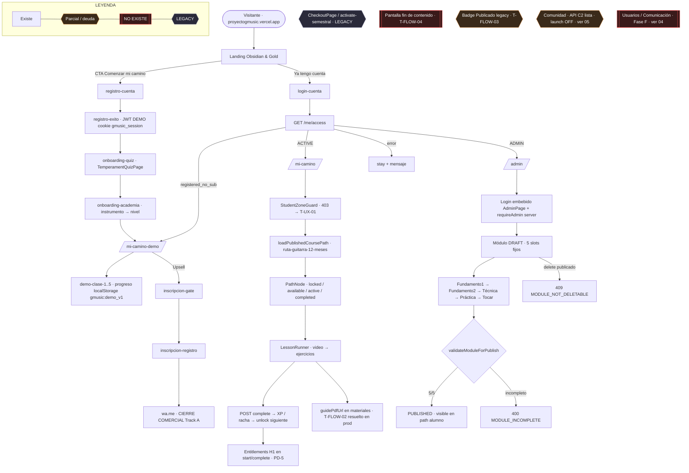

# 00 — Mapa maestro · Academia GMusic

**Host prod:** `proyectogmusic.vercel.app` (SPA Track A)
**Base:** `main` ~`0705032` · prod FE/BE `d48d163` · verificación código 28 Jul 2026
**Roles:** `DEMO` (registered_no_sub) · `ACTIVE` (suscriptor) · `ADMIN`
**Cierre comercial Track A:** WhatsApp (`/inscripcion` → `wa.me`) — J-FLOW-01. Checkout = legacy.

Flujo global: **visitante → registro/demo → alumno → clases → ejercicios → admin**

---

## Índice de diagramas

| # | Archivo | Zona | Estado |
|---|---------|------|--------|
| 00 | (este archivo) | Mapa maestro | Definitivo 28 Jul 2026 |
| 01 | [01-funnel-auth-landing.md](./01-funnel-auth-landing.md) | Visitante → registro/login → demo | Activo · patch v2 aplicado |
| 02 | [02-mi-camino-suscriptor.md](./02-mi-camino-suscriptor.md) | Alumno `/mi-camino` | Activo · patch v2 aplicado |
| 03 | [03-admin-contenido.md](./03-admin-contenido.md) | Admin bloques 5 etapas | Activo · patch v2 aplicado |
| 04 | [04-usuarios-comunicacion-fase-f.md](./04-usuarios-comunicacion-fase-f.md) | Usuarios + comunicación | **Fase F — NO ahora** (propuesta) |
| 05 | [05-comunidad-resumen.md](./05-comunidad-resumen.md) | Comunidad C2 | **Solo referencia** · API-ready, launch OFF |

**Leyenda Mermaid (canon):** nodo normal = existe y funciona · `{{Parcial / deuda}}` · `[["NO EXISTE"]]` · `{{LEGACY / residual}}`.

---

## Mapa global (nodos verificados en código)

---

## Modelo de contenido

`Course → Module → PathNode → MicroExercise` · estados `DRAFT / PUBLISHED / ARCHIVED`
**BLOQUE** = 5 etapas fijas: `Fundamento1 → Fundamento2 → Técnica → Práctica → Tocar`
Curso único hardcoded: `ruta-guitarra-12-meses` (multi-curso = post-piloto).
XP / acierto: **solo servidor** (el runner no puntúa en cliente).

## Deuda activa (detalle en [README](./README.md))

| ID | Estado 28 Jul 2026 |
|----|--------------------|
| T-FLOW-01 | **Fix implementado en este lote** (role en `/me/access` + rama ADMIN en resolver) — pendiente OK Juan + tests en su máquina |
| T-FLOW-02 | Resuelto técnicamente en prod `d48d163` · formalización Lab pendiente |
| T-FLOW-03 | Abierto — badge legacy admin sin UI |
| T-FLOW-04 | Abierto — sin pantalla fin de contenido |
| T-FLOW-05 | Sin repro estático 28 Jul · repro runtime pendiente |
| T-UX-01 | Abierto — mensaje 403 genérico |
