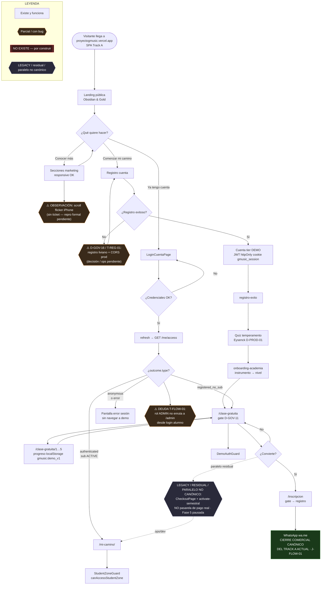

# Flujo 01 — Funnel público, registro y login

**Zona:** visitante anónimo → cuenta demo o suscriptor  
**Auditoría:** 6 Jul 2026 · alineación propuesta 20 Jul 2026 (prod `d48d163`) · **CANON CANDIDATO — PARCIALMENTE DESACTUALIZADO** hasta lote aplicado  
**Cierre comercial Track A actual (J-FLOW-01):** WhatsApp = **CIERRE COMERCIAL CANÓNICO DEL TRACK A ACTUAL** (sustituible por pasarela u otro cierre aprobado más adelante)

## Notas de implementación

| Nodo | Código / decisión |
|------|-------------------|
| Host | Producción observada: `proyectogmusic.vercel.app` (B0-P). `gmusic.academy` = marca/email seed, no hostname SPA. |
| CTA | `academia-public-cta.ts`: label **Comenzar mi camino** → `registro-cuenta` (tests prohíben «Probar gratis»). |
| Post-registro | `RegistroCuentaPage` → DEMO JWT en register → `registro-exito` → quiz → `onboarding-academia` → `clase-gratuita` (`/clase-gratuita`). |
| Login branch | `resolve-post-login-page.ts` + login en `RegistroCuentaPage`/`LoginCuentaPage`: `authenticated`+ACTIVE → `mi-camino`; `registered_no_sub` → `clase-gratuita`; error → stay. |
| ADMIN | Login alumno no distingue rol (T-FLOW-01); admin entra a `/admin` por URL + credencial. |
| WhatsApp | **J-FLOW-01:** CIERRE COMERCIAL CANÓNICO DEL TRACK A ACTUAL. Código prod `d48d163`: `InscripcionRegistroPage` → `wa.me/56953429676`. No es decisión permanente de producto futuro. |
| Checkout | **LEGACY / RESIDUAL / PARALELO NO CANÓNICO** — D-005/D-006 / Fase 5 pausada; no confundir con cierre comercial actual. |
| D-GOV-16 | Registro liviano propuesto; no confundir con ID inexistente «D-REG-01». |
