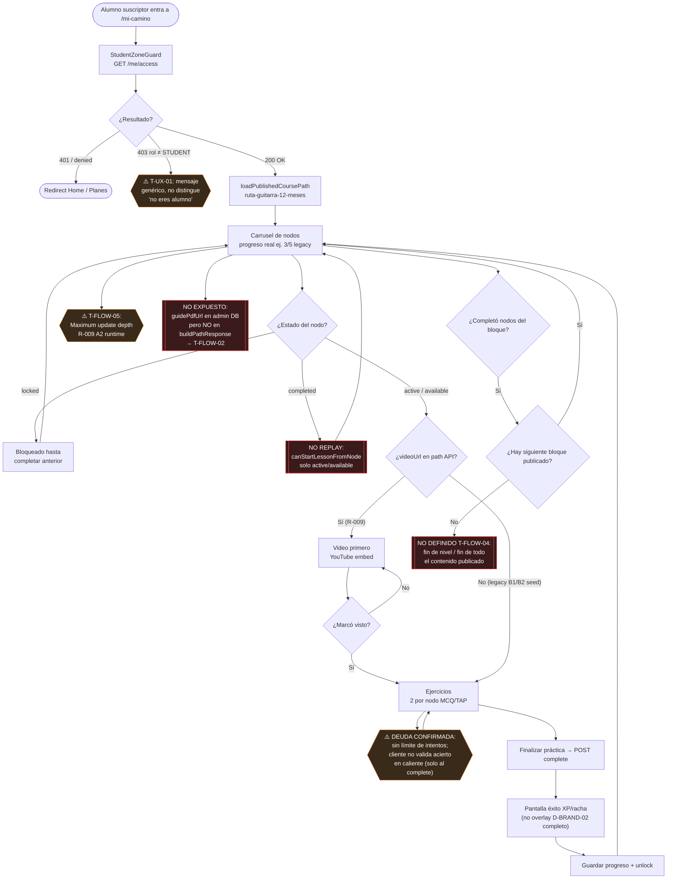

# Flujo 02 — Mi Camino suscriptor

**Zona:** `/mi-camino` · alumno con suscripción ACTIVE  
**Auditoría:** 6 Jul 2026 · canon `docs/flows/`

## Notas de implementación

| Nodo | Código / decisión |
|------|-------------------|
| Path API | `meService.buildPathResponse` expone `videoUrl`; no `guidePdfUrl` |
| Legacy | D-GOV-17 Opción B: seed 3+2 nodos jugables |
| Celebración | `LessonRunnerFinishedState`: XP + racha + precisión; D-BRAND-02 overlay reservado hitos mayores |
| Replay | `path-lesson-start.ts` → `completed` no inicia sesión |
