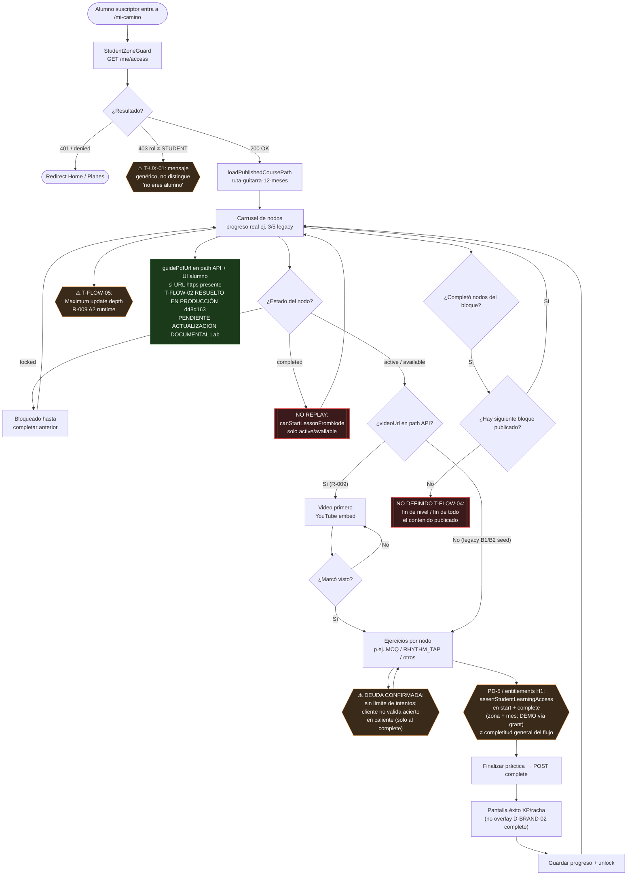

# Flujo 02 — Mi Camino suscriptor

**Zona:** `/mi-camino` · alumno con suscripción ACTIVE  
**Auditoría:** 6 Jul 2026 · alineación propuesta 20 Jul 2026 (prod `d48d163`) · **CANON CANDIDATO — PARCIALMENTE DESACTUALIZADO** hasta lote aplicado  
**T-FLOW-02:** RESUELTO EN PRODUCCIÓN (`d48d163`), **PENDIENTE DE ACTUALIZACIÓN DOCUMENTAL** en Laboratorio — no declarar cierre formal aquí  
**PD-5 / entitlements:** pendientes de documentación explícita en este diagrama (gate técnico existe; no declara flujo «completo»)
**T-FLOW-04 (28 Jul 2026):** CERRADO — al completarse todo lo publicado, `CompletedPathPanel` muestra «Completaste lo publicado» + «No hay más clases publicadas por ahora.» con CTA «Ir a Mi Estudio» y «Seguir en Mi Camino» (revisión de nodos completed sin replay; tarjetas completed inertes).  

```mermaid
flowchart TD
    Entry([Alumno suscriptor entra a /mi-camino]) --> Guard["StudentZoneGuard<br/>GET /me/access"]
    Guard --> GuardResult{¿Resultado?}

    GuardResult -- "401 / denied" --> Home([Redirect Home / Planes])
    GuardResult -- "403 rol ≠ STUDENT" --> T-UX-01{{"⚠️ T-UX-01: mensaje<br/>genérico, no distingue<br/>'no eres alumno'"}}
    GuardResult -- "200 OK" --> LoadPath["loadPublishedCoursePath<br/>ruta-guitarra-12-meses"]

    LoadPath --> Carrusel[Carrusel de nodos<br/>progreso real ej. 3/5 legacy]
    Carrusel --> NodeClick{¿Estado del nodo?}

    NodeClick -- locked --> Locked[Bloqueado hasta<br/>completar anterior]
    Locked --> Carrusel
    NodeClick -- completed --> NoReplay[["NO REPLAY:<br/>canStartLessonFromNode<br/>solo active/available"]]
    NoReplay --> Carrusel
    NodeClick -- active / available --> HasVideo{¿videoUrl en path API?}

    HasVideo -- "Sí (R-009)" --> Video[Video primero<br/>YouTube embed]
    Video --> Watched{¿Marcó visto?}
    Watched -- No --> Video
    Watched -- Sí --> Ejercicio

    HasVideo -- "No (legacy B1/B2 seed)" --> Ejercicio[Ejercicios por nodo<br/>p.ej. MCQ / RHYTHM_TAP / otros]

    Ejercicio --> RetryDebt{{"⚠️ DEUDA CONFIRMADA:<br/>sin límite de intentos;<br/>cliente no valida acierto<br/>en caliente (solo al complete)"}}
    RetryDebt --> Ejercicio
    Ejercicio --> EntH1{{"PD-5 / entitlements H1:<br/>assertStudentLearningAccess<br/>en start + complete<br/>(zona + mes; DEMO vía grant)<br/>≠ completitud general del flujo"}}
    EntH1 --> CompleteFlow[Finalizar práctica → POST complete]
    CompleteFlow --> Exito["Pantalla éxito XP/racha<br/>(no overlay D-BRAND-02 completo)"]
    Exito --> SaveProgress[Guardar progreso + unlock]
    SaveProgress --> Carrusel

    Carrusel --> ReRender{{"⚠️ T-FLOW-05:<br/>Maximum update depth<br/>R-009 A2 runtime"}}

    Carrusel --> PDF["guidePdfUrl en path API + UI alumno<br/>si URL https presente<br/>T-FLOW-02 RESUELTO EN PRODUCCIÓN d48d163<br/>PENDIENTE ACTUALIZACIÓN DOCUMENTAL Lab"]

    Carrusel --> FinModulo{¿Completó nodos del bloque?}
    FinModulo -- Sí --> NextBlock{¿Hay siguiente bloque publicado?}
    NextBlock -- Sí --> Carrusel
    NextBlock -- No --> FinCamino[["NO DEFINIDO T-FLOW-04:<br/>fin de nivel / fin de todo<br/>el contenido publicado"]]

    style T-UX-01 fill:#3a2a1a,stroke:#ffaa55,color:#fff
    style RetryDebt fill:#3a2a1a,stroke:#ffaa55,color:#fff
    style ReRender fill:#3a2a1a,stroke:#ffaa55,color:#fff
    style EntH1 fill:#3a2a1a,stroke:#ffaa55,color:#fff
    style NoReplay fill:#3a1a1a,stroke:#ff5555,color:#fff
    style PDF fill:#1a3a1a,stroke:#55aa55,color:#fff
    style FinCamino fill:#3a1a1a,stroke:#ff5555,color:#fff
```

## Notas de implementación

| Nodo | Código / decisión |
|------|-------------------|
| Path API | `meService.buildPathResponse` + `pathNodePublic.buildPublicPathNodeFields` exponen `videoUrl` y **`guidePdfUrl`** (prod `d48d163`). |
| PDF UI | `LessonMaterialTabs` / `LessonPrepareScreen`: enlace «Ver guía PDF» si hay URL. Función disponible ≠ siempre visible (sin URL) ≠ bypass entitlements. |
| T-FLOW-02 | **RESUELTO EN PRODUCCIÓN, PENDIENTE DE ACTUALIZACIÓN DOCUMENTAL** — cierre formal pendiente de registro y firma en el Laboratorio (aún no registrado). |
| PD-5 | `assertStudentLearningAccess` en `lessonSessionService` / `practiceLifecycleH1Service` (`d48d163`). Separado de T-FLOW-02. |
| Legacy | D-GOV-17 Opción B: seed 3+2 nodos jugables |
| Celebración | `LessonRunnerFinishedState`: XP + racha + precisión; D-BRAND-02 overlay reservado hitos mayores |
| Replay | `path-lesson-start.ts` → `completed` no inicia sesión |
