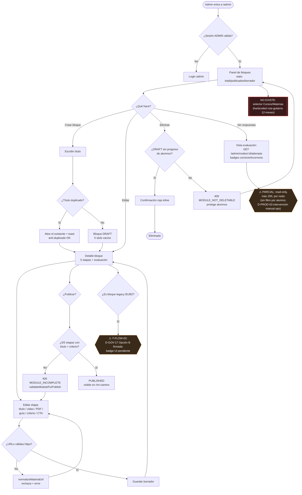

# Flujo 03 — Admin Academia (contenido)

**Zona:** `/admin` · bloques 5 etapas  
**Auditoría:** 6 Jul 2026 · canon `docs/flows/` · alineado Admin Phase B

## Notas de implementación

| Nodo | Código / decisión |
|------|-------------------|
| Publish | `server/services/curriculum.ts` |
| Attempts | `server/services/adminReports.ts` + `AdminPage.tsx` |
| PDF admin | `guidePdfUrl` en PathNode; alumno vía T-FLOW-02 |
