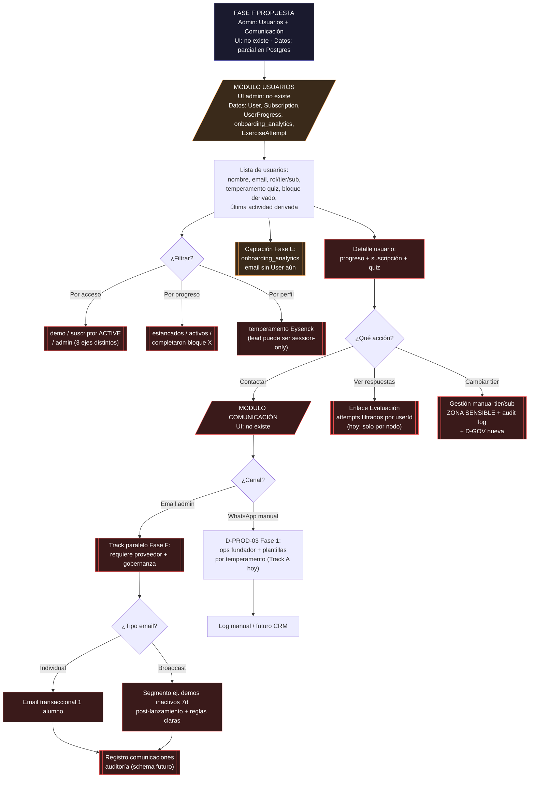

# Flujo 04 — Usuarios + Comunicación (Fase F propuesta)

> **NO es el siguiente sprint.**  
> Orden visión: **Academia (activa)** → **Evaluación + Captación (Fase E)** → **Comunidad (Fase C)** → Landing (Fase D) → **este módulo (Fase F)**.  
> Requiere OK Juan/Opus antes de tocar auth, tiers o email transaccional.

**Auditoría:** 6 Jul 2026 · canon `docs/flows/`

## Relación con visión admin

| Módulo visión | Este diagrama |
|---------------|---------------|
| Evaluación (attempts) | LinkAttempts desde detalle — extiende Fase B, no duplica |
| Captación (Fase E) | Nodo Leads / inbox quiz — **antes** que CRM completo |
| Comunicación email | Track paralelo; no sustituye WhatsApp D-024 / D-PROD-03 |
