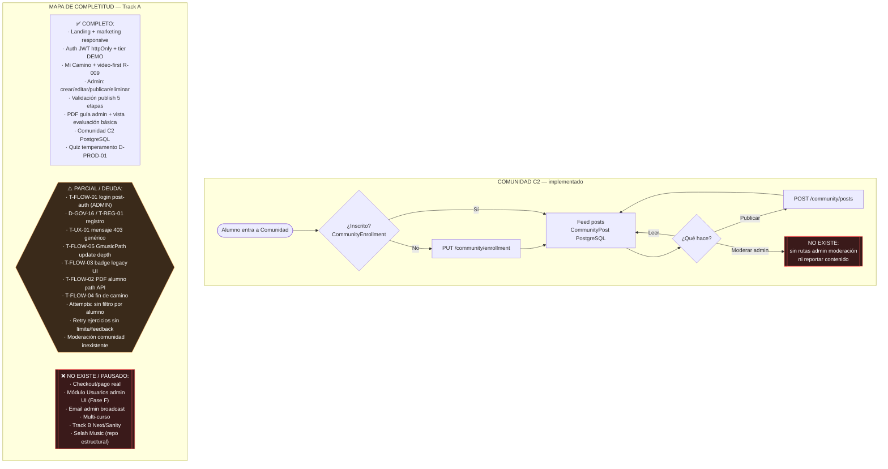

# Flujo 05 — Comunidad C2 + mapa de completitud

**Auditoría:** 6 Jul 2026 · canon `docs/flows/` · tests app **557/557**

## Observaciones (sin ticket)

| Ítem | Estado |
|------|--------|
| Scroll flicker iPhone (landing) | Observación; ticket solo tras repro formal |

*T-FLOW-05 registra update depth GmusicPath (R-009 A2).*

## Referencias

- Índice y matriz: [README.md](./README.md)
- Comunidad API: `server/routes/community.ts`
- Visión admin fases: `docs/vision/specs/2026-07-02-admin-platform-vision.md`
