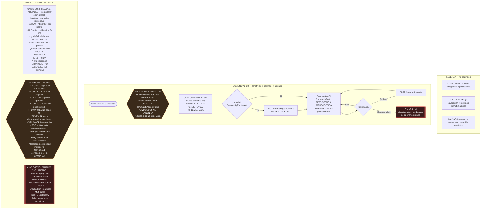

# Flujo 05 — Comunidad C2 + mapa de estado

**Auditoría:** 6 Jul 2026 · alineación propuesta 20 Jul 2026 (prod `d48d163`)  
**Estado producto Comunidad:** **NO LANZADO**  
**Capas (no confundir):** **CONSTRUIDO** (API + persistencia existen) · **NO HABILITADO** (`communityAccess: false`, header locked, navegación no canónica) · **NO LANZADO** (sin recorrido canónico para usuarios reales)  
**Detalle visible:** API IMPLEMENTADA · PERSISTENCIA IMPLEMENTADA · UI PARCIAL · NAVEGACIÓN NO CANÓNICA · ACCESO CONDICIONADO · `communityAccess: false` (línea base observada `d48d163`, no condición eterna) · Header bloqueado · Mocks residuales identificados

```mermaid
flowchart TD
    subgraph LEYENDA["LEYENDA — no equivalen"]
        L1["CONSTRUIDO = existe código / API / persistencia"]
        L2["HABILITADO = flags + navegación + permisos permiten acceso"]
        L3["LANZADO = usuarios reales usan recorrido canónico"]
    end

    subgraph COMUNIDAD["COMUNIDAD C2 — construido ≠ habilitado ≠ lanzado"]
        CEntry([Alumno intenta Comunidad]) --> CGate{{"PRODUCTO NO LANZADO<br/>NO HABILITADO en línea base d48d163<br/>header locked T-MVP-COMMUNITY<br/>communityAccess: false<br/>NAVEGACIÓN NO CANÓNICA<br/>ACCESO CONDICIONADO"}}
        CGate --> CTech["CAPA CONSTRUIDA (no implica lanzamiento):<br/>API IMPLEMENTADA<br/>PERSISTENCIA IMPLEMENTADA"]
        CTech --> CEnrolled{¿Inscrito?<br/>CommunityEnrollment}
        CEnrolled -- No --> CJoin[PUT /community/enrollment<br/>API IMPLEMENTADA]
        CJoin --> CFeed
        CEnrolled -- Sí --> CFeed[Feed posts API<br/>CommunityPost · PERSISTENCIA IMPLEMENTADA<br/>UI PARCIAL + MOCK peers/curated]
        CFeed --> CAction{¿Qué hace?}
        CAction -- Publicar --> CPost[POST /community/posts]
        CPost --> CFeed
        CAction -- Leer --> CFeed
        CAction -- Moderar admin --> CMod[["NO EXISTE:<br/>sin rutas admin moderación<br/>ni reportar contenido"]]
    end

    subgraph RESUMEN["MAPA DE ESTADO — Track A"]
        R1["CAPAS CONFIRMADAS / PARCIALES — no declarar cierre global:<br/>· Landing + marketing responsive<br/>· Auth JWT httpOnly + tier DEMO<br/>· Mi Camino + video-first R-009<br/>· guidePdfUrl alumno API+UI d48d163<br/>· Admin contenido: CRUD publish<br/>· Quiz temperamento D-PROD-01<br/>· Comunidad: CONSTRUIDA API+persistencia<br/>  UI PARCIAL · NO HABILITADA · NO LANZADA"]

        R2{{"⚠️ PARCIAL / DEUDA:<br/>· T-FLOW-01 login post-auth ADMIN<br/>· D-GOV-16 / T-REG-01 registro<br/>· T-UX-01 mensaje 403 genérico<br/>· T-FLOW-05 GmusicPath update depth<br/>· T-FLOW-03 badge legacy UI<br/>· T-FLOW-02 cierre documental Lab pendiente<br/>· T-FLOW-04 fin de camino<br/>· PD-5 entitlements documentar en 02<br/>· Attempts: sin filtro por alumno<br/>· Retry ejercicios sin límite/feedback<br/>· Moderación comunidad inexistente<br/>· Comunidad: NAVEGACIÓN NO CANÓNICA"}}

        R3[["❌ NO EXISTE / PAUSADO / NO LANZADO:<br/>· Checkout/pago real<br/>· Comunidad como producto lanzado<br/>· Módulo Usuarios admin UI Fase F<br/>· Email admin broadcast<br/>· Multi-curso<br/>· Track B Next/Sanity<br/>· Selah Music repo estructural"]]
    end

    style CMod fill:#3a1a1a,stroke:#ff5555,color:#fff
    style CGate fill:#3a2a1a,stroke:#ffaa55,color:#fff
    style R2 fill:#3a2a1a,stroke:#ffaa55,color:#fff
    style R3 fill:#3a1a1a,stroke:#ff5555,color:#fff
```

## Observaciones (sin ticket)

| Ítem | Estado |
|------|--------|
| Scroll flicker iPhone (landing) | Observación; ticket solo tras repro formal |

*T-FLOW-05 registra update depth GmusicPath (R-009 A2). Cifra histórica tests 557/557 (6 Jul): no revalidada aquí — NO DETERMINADO cifra actual.*

## Referencias

- Índice y matriz: [README.md](./README.md)
- Comunidad API: `server/routes/community.ts`
- Entitlements: `server/lib/entitlementsH1.ts` (`communityAccess: false`)
- Header lock: `src/app/components/gmusic/GmusicInternalHeader.tsx`
- Visión admin fases: `docs/vision/specs/2026-07-02-admin-platform-vision.md`
