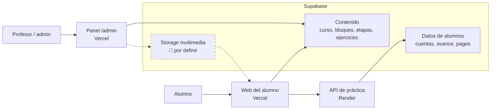
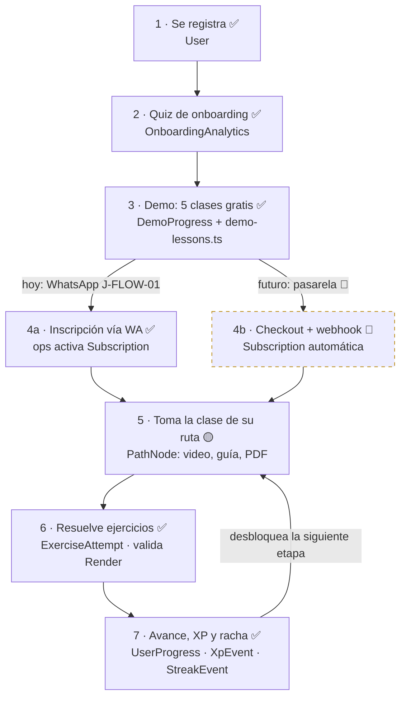
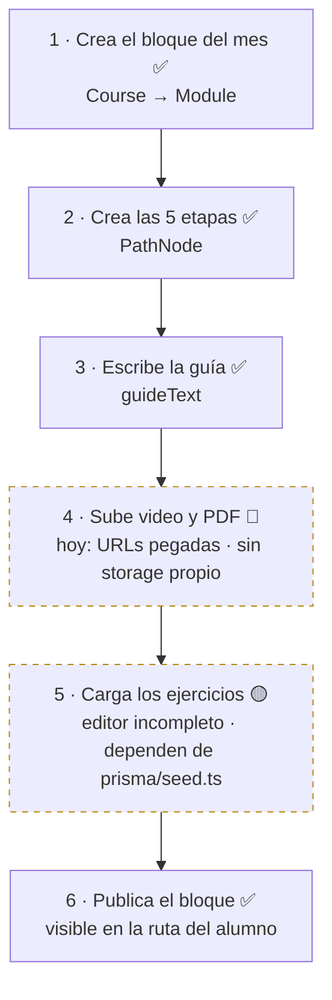
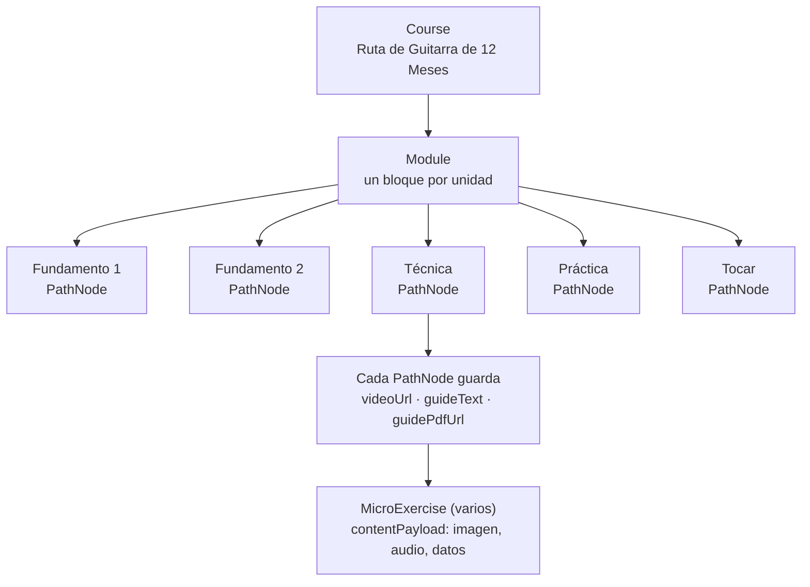
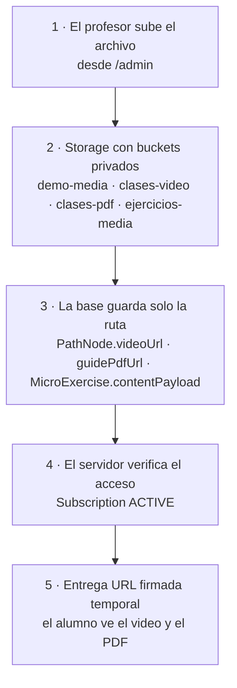
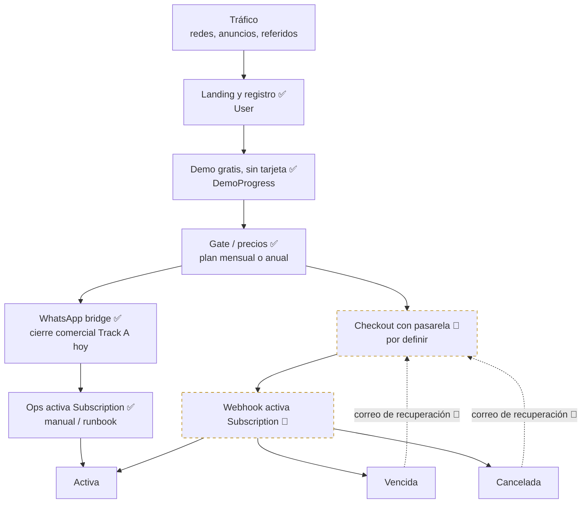
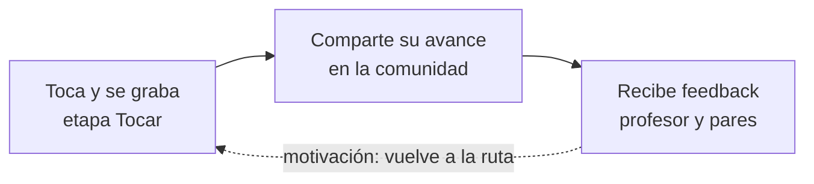

# Mapa del Servicio Académico
**Ruta de Guitarra de 12 Meses**

| | |
|---|---|
| Versión | 1.0 |
| Fecha | 2026-08-03 |
| Ubicación | `docs/servicio-academico/mapa-servicio-academico.md` |
| Se actualiza cuando | cambia una decisión de contenido, storage, pagos o comunidad |
| Documentos compañeros | `.agents/PROJECT_STATUS.md` (estado operativo) · `prisma/schema.prisma` (plano de datos) · `docs/flows/00-mapa-maestro.md` (flujo de producto) |

**Leyenda de estado en este documento**

| Marca | Significado |
|---|---|
| ✅ | Existe y opera hoy |
| 🟡 | Parcial / incompleto |
| 🔴 | No existe · propuesta · no implementar sin frase de Juan |

---

## 0 · Principio rector

La carpeta que sube al hosting **no contiene la academia**; contiene el código que la sirve. El servicio real está repartido así:

| Pieza | Dónde vive | Estado |
|---|---|---|
| Código, demo, documentación | Repo (Vercel lo construye) | ✅ |
| Clases de pago: curso, bloques, etapas, ejercicios | Supabase (tablas) | 🟡 (admin parcial; ejercicios aún dependen de seed) |
| Alumnos, suscripciones, progreso | Supabase (tablas) | ✅ |
| Validación de ejercicios y progreso | Render | ✅ |
| Videos, PDF, imágenes, audio | Storage centralizado | 🔴 por crear |
| Cierre comercial Track A | WhatsApp (`wa.me`) | ✅ (J-FLOW-01) |
| Cobros automatizados | Pasarela + webhook → `Subscription` | 🔴 por definir |

Por eso el orden tiene dos capas: la carpeta (sección 1) y los flujos del servicio (secciones 2 a 8).

---

## 1 · Orden de la carpeta (repo)

Estructura **real hoy** (Vite + React SPA, no App Router de Next.js):

```
Página de cursos de música/
├── src/
│   ├── app/
│   │   ├── pages/              ← landing, registro, demo, alumno, admin, inscripción
│   │   ├── components/         ← UI (gmusic, music, auth…)
│   │   ├── data/
│   │   │   └── demo-lessons.ts ← demo gratis (temporal: migrar a Supabase)
│   │   ├── services/gmusic-api/← cliente HTTP → /api/v1
│   │   └── App.tsx             ← routing string-based (D-018)
│   └── main.tsx
├── server/                     ← API Express (Render)
├── prisma/
│   ├── schema.prisma           ← plano de los datos
│   ├── migrations/             ← historial de cambios
│   └── seed.ts                 ← ejercicios iniciales (a retirar)
├── public/                     ← SOLO marca e interfaz, nada de clases
├── docs/
│   ├── operations/
│   ├── flows/
│   └── servicio-academico/     ← este mapa
├── vercel.json                 ← rewrites SPA + proxy API + cron keep-alive
└── .agents/PROJECT_STATUS.md
```

Capas de producto (lógicas, no carpetas Next):

| Capa | Rutas / pantallas principales |
|---|---|
| **VENTA** | landing, precios/planes, inscripción → WhatsApp |
| **ALUMNO** | registro, demo, `/alumno`, `/mi-camino`, lección |
| **ADMIN** | `/admin` — bloques y etapas |

**Reglas fijas del repo**

1. `public/` es solo marca e interfaz. Ningún material de clase entra ahí jamás.
2. La base de datos guarda rutas (`videoUrl`, `guidePdfUrl`, `contentPayload`), nunca archivos pesados.
3. `demo-lessons.ts` es temporal: su destino es el mismo árbol de Supabase con marca de «gratis».
4. `seed.ts` es andamiaje: se retira cuando el editor de ejercicios esté completo.

---

## 2 · Mapa general del servicio



Las líneas punteadas hacia y desde Storage son el eslabón faltante: hoy nadie sube archivos a un almacén propio; se pegan URLs (YouTube / enlaces externos).

---

## 3 · Flujo del alumno



Notas:

- Cada práctica registra además `LessonSession`.
- Pasos 1 a 3 = fase gratis; del acceso pagado en adelante = zona suscriptor (`StudentZoneGuard`).
- **Hoy no hay pasarela en prod.** El cierre comercial Track A es WhatsApp; la activación de `Subscription` es operativa/manual. La pasarela es decisión futura (sección 7 y registro).

---

## 4 · Flujo del administrador (crear y publicar una clase)



Los dos pasos punteados/amarillos son los eslabones débiles de hoy. El demo queda fuera de este flujo: se edita en código y exige deploy; su destino es entrar a este mismo flujo (regla 3 de la sección 1).

---

## 5 · Estructura de clases y lecciones



Las 5 etapas son fijas en cada bloque: Fundamento 1, Fundamento 2, Técnica, Práctica, Tocar. Un `PathNode` = una etapa; un `Module` = el bloque con esas cinco etapas.

---

## 6 · Multimedia y PDF

**Decisión propuesta: Supabase Storage** (🔴 por confirmar — ver registro).

- Razón: la base y la autenticación ya viven ahí; URLs firmadas impiden que un no-suscriptor comparta el enlace de un video o PDF de pago.
- Buckets propuestos: `demo-media` (público o firmado corto) · `clases-video` · `clases-pdf` · `ejercicios-media` (privados).
- Riesgo: el egress de video se encarece con volumen. Plan B: con cientos de alumnos, mover solo el video a Cloudflare R2/Stream o Mux; PDF, imágenes y audio se quedan en Supabase.

**No crear buckets ni subir archivos de prod hasta confirmar esta decisión** (runbook propio + permisos + política de firmado).



---

## 7 · Venta y suscripciones



Regla del embudo (destino): vencida o cancelada pierde el contenido de pago pero **conserva su progreso** (`UserProgress` intacto). Cada baja es un lead caliente que vuelve por correo al checkout.

Pendiente: elegir pasarela (Stripe, Mercado Pago, Wompi u otra) y conectar su webhook a `Subscription`. Hasta entonces, WhatsApp + activación ops siguen vigentes.

---

## 8 · Comunidad

**Estado real hoy (D-COMM-BPLUS-001):** tab Comunidad **habilitada en nav**, UI parcial, mocks saneados, producto **NO LANZADO**. Hay API/persistencia construida; no es «cero código».

**Propuesta de piloto de feedback (etapa Tocar → compartir → feedback):**



| Opción | Qué implica | Cuándo |
|---|---|---|
| B · Fuera de la app (Discord o WhatsApp grupo) | Cero/bajo desarrollo; valida si la gente participa | Primera recomendada para el loop de feedback |
| A · Dentro de la app (feed/posts/comentarios completos) | Semanas de desarrollo + moderación; hay base parcial | Solo si B demuestra participación real · no reabrir launch sin frase |

---

## 9 · Las 6 preguntas del mapa

| Pregunta | Hoy | Destino |
|---|---|---|
| 1. ¿Dónde se crea una clase? | Panel `/admin` (bloques y etapas); ejercicios a medias | `/admin` completo, sin `seed.ts` |
| 2. ¿Dónde se almacena? | Supabase (`Course → Module → PathNode → MicroExercise`); demo en código | Todo en Supabase, demo incluido |
| 3. ¿Dónde se suben sus archivos? | No hay almacén propio: se pegan URLs a mano | Supabase Storage con buckets (tras confirmar D-STORAGE-01) |
| 4. ¿Cómo se publica? | Botón de publicar en `/admin` | Igual, más vista previa antes de publicar |
| 5. ¿Cómo la recibe el alumno? | Vercel lee API/Render → Supabase; Render valida ejercicios | Igual, más URLs firmadas para multimedia |
| 6. ¿Dónde queda su progreso? | `UserProgress`, `LessonSession`, `ExerciseAttempt`, `XpEvent`, `StreakEvent` | Igual (PD-2 sigue bloqueado para producción) |

---

## 10 · Orden de construcción

1. **Confirmar Storage (D-STORAGE-01)** — proveedor, buckets, privacidad, firmado, tamaños; **después** crear los 4 buckets y subir video+PDF de **una** etapa real. Desbloquea las secciones 2, 4 y 6.
2. **Editor de ejercicios en `/admin`** — retirar la dependencia de `prisma/seed.ts`.
3. **Pasarela de pago** — checkout + webhook hacia `Subscription` (sustituye o complementa el bridge WhatsApp según decisión).
4. **Migrar el demo a Supabase** con marca de «gratis» — un solo sistema de contenido.
5. **Comunidad** — piloto Opción B (Discord) para el loop de feedback; ampliar producto interno solo con participación demostrada y frase de Juan.

**No ejecutar el paso 1 operativo (crear buckets) hasta la frase de confirmación de Storage.**

---

## Registro de decisiones

| Fecha | Decisión | Estado |
|---|---|---|
| 2026-08-03 | Este mapa es la fuente de verdad del servicio académico (capa servicio; no reemplaza `docs/flows/` ni PROJECT_STATUS) | Vigente |
| 2026-08-03 | Cierre comercial Track A hoy = WhatsApp (J-FLOW-01); pasarela automatizada = futuro | Vigente |
| 2026-08-03 | Storage: Supabase Storage con 4 buckets (`demo-media`, `clases-video`, `clases-pdf`, `ejercicios-media`) | 🔴 Propuesta, por confirmar |
| 2026-08-03 | Pasarela de pago (Stripe / Mercado Pago / Wompi / otra) | 🔴 Por definir |
| 2026-08-03 | Comunidad feedback: empezar con Opción B (Discord/externa); producto in-app NO LANZADO (B+ parcial vigente) | 🔴 Propuesta, por confirmar |

Cuando confirmen storage y pasarela, actualizar este registro y subir la versión a **1.1**.
