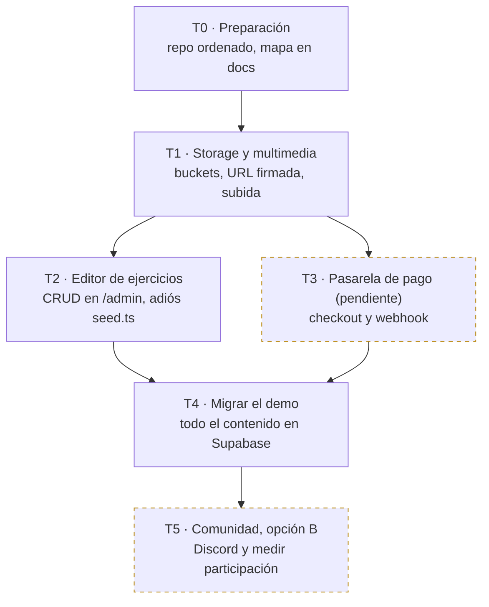

# Runbook T-CONCRET
**De "página" a "academia como servicio" — ejecución por fases**

| | |
|---|---|
| Versión | 1.1 |
| Fecha | 2026-08-03 |
| Ubicación | `docs/servicio-academico/runbook-t-concret.md` |
| Documento madre | `mapa-servicio-academico.md` (los flujos y decisiones viven allá) |

**Reglas de uso**

1. Una sola fase abierta a la vez. T2 y T3 pueden correr en paralelo únicamente si hay dos personas; si estás solo, primero T2.
2. Una fase se cierra solo cuando se cumple su criterio de cierre, no cuando "casi".
3. Cada casilla marcada debería corresponder a un commit o a un cambio verificable.
4. Al cerrar una fase, actualiza el registro de decisiones del mapa y sube la versión de este runbook.

---

## T0 · Preparación

Objetivo: base ordenada antes de construir nada.

- [ ] **T0.1 · Versionar los mapas** — Guarda `mapa-servicio-academico.md` y este runbook en `docs/servicio-academico/` y haz commit: `git add docs/servicio-academico && git commit -m "docs: mapa y runbook del servicio académico v1.0"`.
- [ ] **T0.2 · Reordenar páginas (opcional)** — Con `git mv`, agrupa `src/app/pages/` en `marketing/`, `alumno/`, `demo/` y `admin/` sin cambiar rutas ni lógica; actualiza solo los imports en `App.tsx` y verifica suite + build + preview de Vercel. No bloquea T1: puede posponerse.
- [ ] **Cierre T0** — Deploy verde en Vercel con la estructura nueva.

---

## T1 · Storage y multimedia

Objetivo: que exista un lugar oficial donde viven los archivos y una forma segura de entregarlos. Desbloquea T2, T4 y la protección del contenido de pago.

- [ ] **T1.1 · Crear buckets** — Antes de crear nada: **Settings → Billing** (plan) y **Settings → Storage** (límite real de subida). En **Free**: máx. **50 MB/archivo** y **1 GB** total del proyecto — un video largo puede agotar la cuota; para el piloto usar video comprimido ≤50 MB (720p H.264). En **Pro**: límites mayores (~100 GB incluidos). Luego en Storage crea `demo-media` (público) y `clases-video`, `clases-pdf`, `ejercicios-media` (privados).
- [ ] **T1.2 · Blindar lo privado** — Abre en una ventana de incógnito la URL directa de un archivo de un bucket privado y confirma que devuelve error de acceso; si abre, corrige las políticas del bucket antes de seguir.
- [ ] **T1.3 · Piloto manual** — Sube el video y el PDF de una etapa real a sus buckets y guarda las rutas en `PathNode.videoUrl` y `PathNode.guidePdfUrl` de esa etapa. Si la clase real aún no está grabada, cualquier video ≤ límite del plan y cualquier PDF sirven: T1 valida el flujo técnico, no la calidad del contenido (reemplazar archivo en bucket después, sin tocar código).
- [ ] **T1.4 · URL firmada (en la API de Render)** — En la API de Render crea el endpoint que, solo si el `User` tiene `Subscription` activa, genere una URL firmada temporal (p. ej. 1 hora) usando la service role key y la devuelva al front. La service role key NUNCA va en el front: todo lo que Vite empaqueta queda expuesto en el navegador.
- [ ] **T1.5 · Subir desde /admin** — Agrega al editor de etapas un campo de archivo que suba al bucket correcto y escriba la ruta en el `PathNode` automáticamente: nadie vuelve a pegar URLs a mano.
- [ ] **Cierre T1** — Un suscrito ve el video y el PDF piloto dentro de la app; un no suscrito no puede abrirlos ni con el enlace.

---

## T2 · Editor de ejercicios

Objetivo: publicar un bloque completo sin tocar código.

- [ ] **T2.1 · Inventario del seed** — Lista los tipos de ejercicio y los campos de `contentPayload` que hoy crea `prisma/seed.ts`; ese inventario es el alcance exacto del editor.
- [ ] **T2.2 · CRUD de ejercicios** — Construye en `/admin` el formulario para crear, editar y borrar `MicroExercise` dentro de cada etapa, cubriendo todos los tipos del inventario.
- [ ] **T2.3 · Media del ejercicio** — Reutiliza el campo de archivo de T1.5 para subir la imagen o el audio del ejercicio a `ejercicios-media` y guardarlo en `contentPayload`.
- [ ] **T2.4 · Retirar el seed** — Recrea desde `/admin` los ejercicios que hoy dependen del seed y deja `seed.ts` solo para entornos de desarrollo.
- [ ] **Cierre T2** — Un bloque nuevo (5 etapas con sus ejercicios) se crea y publica de punta a punta desde `/admin`.

---

## T3 · Pasarela de pago

> Modo manual vigente: la venta se cierra por WhatsApp y la suscripción se activa editando a mano la fila en `Subscription` (Supabase Studio) con su fecha de vencimiento; T1.4 es lo que hace efectiva esa activación. Disparador para construir T3: más de 10 pagos al mes o más de 30 minutos diarios de activaciones manuales (cifras ajustables).

Objetivo: que el dinero entre solo y active el acceso solo. La pasarela aún no está elegida: T3.1 es una decisión, no un desarrollo.

- [ ] **T3.1 · Elegir pasarela** — Decide según el país de tus alumnos (Stripe, Mercado Pago, Wompi u otra) y anótalo en el registro de decisiones del mapa.
- [ ] **T3.2 · Checkout en modo prueba** — Conecta la página de precios a una sesión de pago de la pasarela en sandbox, con plan mensual y anual.
- [ ] **T3.3 · Webhook** — Crea el endpoint que reciba pago aprobado, renovación, fallo y cancelación, y escriba el estado en `Subscription` (activa, vencida, cancelada).
- [ ] **T3.4 · Compuerta de acceso** — Aplica en toda la ruta paga la misma verificación de `Subscription` activa que ya usa T1.4; sin suscripción vigente, redirige a la página de precios.
- [ ] **T3.5 · Prueba punta a punta** — En sandbox: paga y confirma que entras; cancela y confirma que pierdes el contenido de pago pero `UserProgress` queda intacto.
- [ ] **Cierre T3** — El primer pago real crea la `Subscription` vía webhook, sin intervención manual.

---

## T4 · Migrar el demo

Objetivo: un solo sistema de contenido; editar el demo deja de requerir deploy.

- [ ] **T4.1 · Marca "gratis"** — Agrega mediante migración de Prisma un campo booleano (por ejemplo `isFree`) al contenido, para señalar bloques o etapas gratuitas.
- [ ] **T4.2 · Cargar el demo en /admin** — Crea las 5 clases del demo como bloque gratis usando el flujo ya construido en T1.5 y T2.2.
- [ ] **T4.3 · Apuntar la web a Supabase** — Haz que las páginas del demo lean el bloque gratis desde Supabase en lugar de `demo-lessons.ts`, conservando `DemoProgress` tal cual.
- [ ] **T4.4 · Retirar el archivo** — Tras una semana estable en producción, saca `src/app/data/demo-lessons.ts` del flujo.
- [ ] **Cierre T4** — Cambias un texto del demo desde `/admin` y se ve en producción sin deploy.

---

## T5 · Comunidad (opción B)

Objetivo: validar participación real antes de construir nada dentro de la app.

- [ ] **T5.1 · Crear el espacio** — Abre el servidor de Discord o el grupo de WhatsApp con un canal dedicado a compartir grabaciones de la etapa Tocar.
- [ ] **T5.2 · Puente desde la app** — Agrega el botón "Comparte tu avance" con el enlace de invitación al terminar cada etapa Tocar.
- [ ] **T5.3 · Ritual del profesor** — Fija un día semanal en el que el profesor comenta todas las grabaciones publicadas esa semana.
- [ ] **T5.4 · Medir 4 semanas** — Registra cada semana cuántos suscritos activos publicaron; solo con participación real se abre la evaluación de la opción A (comunidad dentro de la app).
- [ ] **Cierre T5** — 4 semanas de datos de participación anotados en el registro de decisiones del mapa.

---

## Historial del runbook

| Fecha | Versión | Cambio |
|---|---|---|
| 2026-08-03 | 1.0 | Creación: fases T0–T5 con instrucción por etapa y criterio de cierre |
| 2026-08-03 | 1.1 | Stack Vite corregido (T0.2 opcional); T1.4 en Render; T3 modo manual con disparador |
